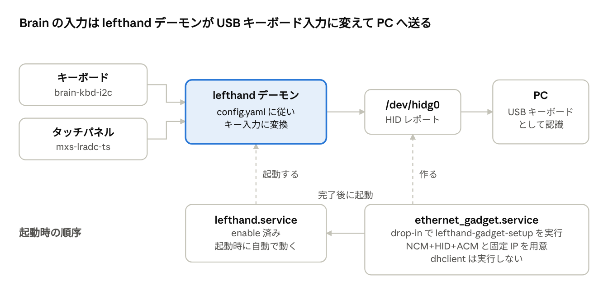
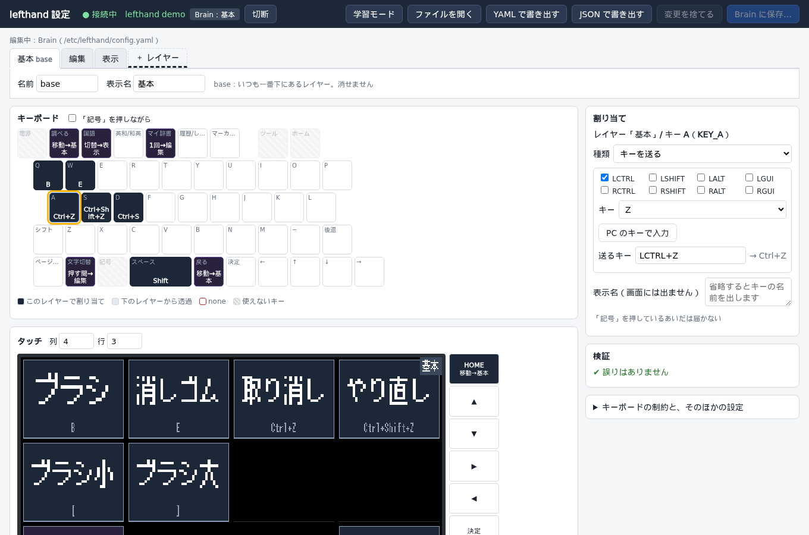

# lefthand

Sharp Brain PW-SH2 を、PC 用の左手デバイスにするデーモン。
Brain 上の Brainux で動き、本体のキーボードとタッチパネルの入力を、設定どおりのキー入力やマウスの操作に変えて
USB HID のキーボードとマウスとして PC に送る。タッチパネルの画面には、どこを押すと何が送られるかを表示する。

- **キーボード**：本体のキーごとに、PC に送るキーやショートカットを割り当てる。例：A キーで Ctrl+Z。
- **タッチパネル**：画面を格子に分け、セルごとにキーを割り当てる。セルの枠とラベルが画面に表示され、押しているセルは枠が黄色く光る。
- **トラックパッド**：タッチパネルのセルを、マウスのトラックパッドにできる（`widget: trackpad`）。指でカーソルを動かし、タップでクリック、右端の帯でスクロール。キーやセルにマウスのボタンも割り当てられる（`mouse: left`）。Android のスマホでもそのまま使える。起動したときはブートキーボード（BIOS でも使える）で、マウスを使うときだけ USB の形を切り替える（`usb_mode`）。
- **ウィジェット**：タッチのセルに、キーの代わりに時計、テキスト、Todo、カレンダーの予定を表示できる。セルは複数の格子にまたがる大きさにもできる（`span`）。
- **背景画像**：セルごとの背景と、レイヤーごとの壁紙に、好きな画像を置ける。画像の切り抜きと変換は設定 GUI（PC）で行い、Brain は変換済みの画像を写すだけ。
- **brain-deck**：PC のコマンド。ビルドの結果などのテキストを Brain の画面に出したり（`brain-deck text build "ビルド成功" --style ok`）、Todo を足したり、カレンダー（ICS）の予定を送ったり（`brain-deck calendar sync`）、Brain の時刻を合わせたりする。
- **端末モード**：Brain の画面とキーボードを、USB でつないだ PC のコンソールの端末にする。画面やキーボードのない PC に、Brain からログインして操作できる（PC の OS が起動したあとだけ。BIOS や GRUB は見えない）。PC 側の設定が一度だけ要る。
- **時刻合わせ**：Brain には電池で動く時計（RTC）がないので、設定 GUI が接続したときに PC の時刻に合わせる。
- **レイヤー**：キーとタッチの割り当てを、まとめて切り替えられる。押しているあいだだけ、押すたびに、次の 1 キーだけ、の切り替え方がある。今のレイヤー名は画面の右上に出る。
- **PC から見た Brain**：標準の USB キーボードとして見えるので、PC 側に専用のソフトは要らない。同じ USB ケーブルで、設定や保守のためのネットワーク（SSH）とシリアルも使える。
- **設定 GUI**：PC のブラウザ（Chrome / Edge）から、USB シリアル経由で設定を読み書きできる。保存するとデーモンを止めずにすぐ反映する。

## 目次

1. [仕組み](#仕組み)
2. [必要なもの](#必要なもの)
3. [ビルド](#ビルド)
4. [インストール](#インストール)
5. [PC との接続](#pc-との接続)
6. [設定](#設定)
7. [マウスとトラックパッド](#マウスとトラックパッド)
8. [設定 GUI](#設定-gui)
9. [brain-deck（PC のコマンド）](#brain-deckpc-のコマンド)
10. [時刻合わせ](#時刻合わせ)
11. [タッチのキャリブレーション](#タッチのキャリブレーション)
12. [日常の操作](#日常の操作)
13. [シリアルコンソール](#シリアルコンソール)
14. [端末モード](#端末モード)
15. [画面とコンソール](#画面とコンソール)
16. [困ったとき](#困ったとき)
17. [開発](#開発)
18. [フォントとライセンス](#フォントとライセンス)

## 仕組み



```
本体キーボード (brain-kbd-i2c)  ─┐
                                  ├─ lefthand ─→ /dev/hidg0 ─→ USB ─→ PC（キーボードとマウスとして認識）
タッチパネル   (mxs-lradc-ts)   ─┘      │  │
                                         │  └─→ /dev/fb0（セルとラベルを表示）
PC のブラウザ（設定 GUI） ←─ USB シリアル ─→ /dev/ttyGS1（設定の読み書き、学習モード）
```

- **入力の専有**：デーモンは本体のキーボードとタッチパネルを専有する。動いているあいだ、Brain 自身のコンソールには入力が届かない。
- **送信**：押したキーの組み合わせを、標準の 8 バイトのキーボードレポート（前にレポート ID 1 を付ける）で送る。同時に押せる通常キーは 6 つまで。オートリピートは PC 側に任せる。マウスは、レポート ID 2 のレポート（ボタン 3 つ、移動、縦と横のホイール）で送る。
- **終了時**：すべてのキーとマウスのボタンを離したレポートを送ってから終わる。キーやボタンが押しっぱなしにならない。
- **PC が応答しないとき**：PC が未接続やスリープ中でも、デーモンは止まらない。送れなかった状態は 0.2 秒ごとに送り直す。

起動時は、次の順に動く。

1. `ethernet_gadget.service` が USB ガジェットを作る。Brainux 標準の処理を drop-in で置き換え、ネットワーク（NCM）、キーボードとマウス（HID）、シリアル 2 つ（ACM。コンソール用と設定 GUI 用）の複合デバイスにする。Brain の usb0 には固定 IP 192.168.7.2 を付ける。
2. `lefthand.service` がデーモンを起動する。ガジェットの作成と、ログイン画面の ly の起動を待ってから動く。

電源を入れてからキー入力を受け付けるまで、約 68 秒かかる。

## 必要なもの

- **Brain 本体**：Sharp Brain PW-SH2 に Brainux（Debian 13 ベース）を入れたもの。カーネルが USB ガジェットの HID と ACM に対応していること。Brainux 標準のカーネルは対応していないので、再ビルドする。手順は [docs/kernel-build.md](docs/kernel-build.md)。
- **PC**：ビルド用に Go 1.27 以降。cgo は使わない。
- **USB ケーブル**：Brain と PC をつなぐもの。動作確認は Linux の PC で行った。

## ビルド

PC で、ARMv5（ARM926EJ-S）向けにクロスコンパイルする。

```sh
GOOS=linux GOARCH=arm GOARM=5 CGO_ENABLED=0 go build -trimpath -o lefthand
go test ./...
```

できる実行ファイルは約 5.5MB で、フォントも含めてこれ 1 つで動く。

## インストール

PC から Brain にファイルを送り、Brain 上で install.sh を実行する。

```sh
scp -r lefthand config.yaml install.sh gadget-setup.sh console-setup.sh systemd brain:lefthand/
ssh brain 'cd ~/lefthand && sudo sh install.sh'
```

install.sh は次のファイルを配置し、`systemctl daemon-reload` を行う。

| 手元のファイル | Brain 上の配置先 |
| --- | --- |
| lefthand | /usr/local/bin/lefthand |
| gadget-setup.sh | /usr/local/sbin/lefthand-gadget-setup |
| config.yaml | /etc/lefthand/config.yaml（まだ無いときだけ） |
| systemd/ethernet_gadget.service.d/lefthand.conf | /etc/systemd/system/ethernet_gadget.service.d/ |
| systemd/lefthand.service | /etc/systemd/system/ |

- **設定ファイル**：install.sh は、既にある `/etc/lefthand/config.yaml` を上書きしない。手元の設定を反映するときは、手動でコピーする。

  ```sh
  ssh brain 'cd ~/lefthand && sudo install -m 0644 config.yaml /etc/lefthand/config.yaml && sudo systemctl restart lefthand.service'
  ```

- **自動起動**：install.sh はサービスを有効にしない。初めて入れたときは、一度だけ有効にする。

  ```sh
  ssh brain sudo systemctl enable --now lefthand.service
  ```

- **ガジェットの設定**：drop-in と gadget-setup.sh は、次に Brain を起動したときから使われる。再起動せずに設定 GUI 用のシリアルを足すときは、`ssh brain sudo /usr/local/sbin/lefthand-gadget-setup` を実行する。USB を一度付け直すので、SSH が数秒止まる。そのあいだ lefthand.service を止め、終わったら再開する（このカーネルでは、/dev/hidg0 を開いたまま付け直すと、HID が使えなくなるため）。SSH が切れても止まらないよう、`sudo systemd-run --collect /usr/local/sbin/lefthand-gadget-setup` で実行するとよい。
- **元に戻す**：drop-in を消して `systemctl daemon-reload` すると、Brainux 標準のガジェット設定に戻る。Brainux 本体のファイルは書き換えていない。
- **シリアルコンソール**：1 つ目のシリアル（/dev/ttyGS0）でログインできるようにするには、一度だけ次を実行する（[シリアルコンソール](#シリアルコンソール)）。

  ```sh
  ssh brain 'cd ~/lefthand && sudo sh console-setup.sh on'
  ```

## PC との接続

USB でつなぐと、PC には次の 4 つが見える。

| 機能 | インターフェイスの番号 | PC 側の見え方 | Brain 側 | 用途 |
| --- | --- | --- | --- | --- |
| NCM | 0、1 | ネットワークインターフェース（Linux では enx8a158b443a01） | usb0 | SSH |
| HID | 2 | 「SHARP Brain」のキーボード（ブートキーボード）。マウスをオンにすると「SHARP Brain Keyboard」と「SHARP Brain Mouse」（Linux の /dev/input/by-id/ では `…-if02-event-kbd` と `…-if02-event-mouse`） | /dev/hidg0 | 左手デバイスとしての入力 |
| CDC-ACM（1 つ目） | 3、4 | シリアルポート（Linux では /dev/ttyACM0、by-id は `…-if03`） | /dev/ttyGS0 | シリアルコンソール（getty のログイン画面）。設定 GUI のコンソールのタブ。[端末モード](#端末モード)では逆向きに使う |
| CDC-ACM（2 つ目） | 5、6 | シリアルポート（Linux では /dev/ttyACM1、by-id は `…-if05`） | /dev/ttyGS1 | 設定 GUI、brain-deck |

- **HID は 2 つの形を切り替える**：Brain の USB コントローラは、PC へ送るためのエンドポイント（IN）が 7 本しかなく、NCM（2 本）、HID（1 本）、ACM 2 つ（4 本）ですべて使っている。マウスを別の HID にすると足りなくなり、ガジェット全体がつながらなくなる。そこで、1 つの HID を次の 2 つの形で切り替える（[USB の形の切り替え](#usb-の形の切り替えマウスのオンとオフ)）。インターフェイスの番号は、どちらの形でも同じ。
  - **キーボードだけ（起動したときの形）**：ブートキーボード。PC の BIOS や UEFI の画面、起動前のパスワード入力でも使える。
  - **キーボードとマウス**：レポート ID でキーボード（1）とマウス（2）を入れた形。ブートキーボードではないので、BIOS や UEFI の画面では使えない。

キーボードとしては、つなぐだけで使える。SSH を使うには、PC 側のインターフェースに固定 IP を付ける。PC に DHCP サーバーは要らない。

| 機器 | アドレス |
| --- | --- |
| PC | 192.168.7.1/24 |
| Brain の usb0 | 192.168.7.2/24 |

PC の `~/.ssh/config` に次のように書いておくと、`ssh brain` で入れる。この README のコマンドは、この設定を前提にしている。

```
Host brain
    HostName 192.168.7.2
    User user
```

## 設定

設定は `/etc/lefthand/config.yaml` に YAML（または JSON）で書く。[設定 GUI](#設定-gui) を使うか、ファイルを直接編集して `sudo systemctl restart lefthand.service` で反映する。
設定 GUI で保存すると、ファイルは GUI が YAML で書き直すので、**手で書いたコメントは消える**。前の版は `/etc/lefthand/config.yaml.prev` に残る。
形式の詳細は [docs/config.md](docs/config.md)、本体のキーの名前は [docs/keymap-pwsh2.md](docs/keymap-pwsh2.md) にある。
書き方の例は、このリポジトリの config.yaml にある。

変更する前に、デーモンを止めずに検証できる。

```sh
ssh brain lefthand -check /etc/lefthand/config.yaml
```

### 全体

```yaml
hid_device: /dev/hidg0      # 送信先。省略可
keyboard: brain-kbd-i2c     # 本体キーボード。省略可
touch: { ... }              # タッチパネルとソフトキーの範囲。省略するとタッチと画面を使わない
layers: [ ... ]             # レイヤーごとの割り当て。最初のものが base
display: { ... }            # 画面表示。省略可
```

入力デバイスは、`/dev/input/eventN` のパスでも、デバイス名でも指定できる。
event の番号は起動の順で変わることがあるので、デバイス名で書く。

### レイヤー（layers）

```yaml
layers:
  - name: base
    label: "基本"
    keys:
      KEY_Q: B                               # Q で B
      KEY_A: LCTRL+Z                         # A で Ctrl+Z
      KEY_LEFTALT: { layer_hold: edit }      # 文字切り替えを押しているあいだ edit
      KEY_ESC: { layer_to: base }            # 調べる・戻るで base に戻る
    touch:
      cols: 4
      rows: 3
      cells:
        "0,0": { key: B, label: "ブラシ" }
        "3,2": { layer_toggle: edit, label: "編集" }
  - name: edit
    label: "編集"
    keys:
      KEY_Q: LCTRL+C                         # edit では Q で Ctrl+C
      KEY_W: none                            # 何もしない
```

- **キーの名前**：左側は Linux のキー名（`KEY_A`、`KEY_SPACE` など）。どのキーがどの名前かは [docs/keymap-pwsh2.md](docs/keymap-pwsh2.md) にある。
- **送るキー**：右側は送るキーを `+` でつなぐ。大文字小文字は区別しない。
- **切り替え**：`layer_hold`（押しているあいだ）、`layer_toggle`（押すたび）、`layer_oneshot`（次の 1 キーだけ）、`layer_to`（そのレイヤーへ移る）の 4 つ。
- **透過**：書いていないキーとセルは、下のレイヤーの割り当てを使う。`none` と書くと無効になる。
- **押したまま切り替えたとき**：キーは押したときの割り当てで離すので、押しっぱなしにならない。
- **base に戻る手段**：切り替えたままになるレイヤーには、base に戻る手段が要る。ないと、読み込み時にエラーになる。
- **旧形式**：トップレベルに `keys` と `touch.cells` を書く形式も、base レイヤーとしてそのまま読める。

PC に送れるキーの名前は次のとおり。

| 種類 | 名前 |
| --- | --- |
| 修飾キー | LCTRL、LSHIFT、LALT、LGUI、RCTRL、RSHIFT、RALT、RGUI |
| 文字 | A〜Z、0〜9 |
| ファンクション | F1〜F12 |
| 編集 | ENTER、ESC、BACKSPACE、TAB、SPACE、INSERT、DELETE、HOME、END、PAGEUP、PAGEDOWN |
| 矢印 | UP、DOWN、LEFT、RIGHT |
| テンキー | KP0〜KP9、KPPLUS（+）、KPMINUS（-）、KPASTERISK（*）、KPSLASH（/）、KPDOT（.）、KPENTER |
| 記号 | MINUS（-）、EQUAL（=）、LEFTBRACE（[）、RIGHTBRACE（]）、BACKSLASH（\）、SEMICOLON（;）、APOSTROPHE（'）、GRAVE（`）、COMMA（,）、DOT（.）、SLASH（/） |

記号は US 配列での位置を送る。PC が日本語配列のときは、PC 側で別の文字になることがある。
`+` のように配列で位置が違う文字は、テンキーの名前で送ると配列によらない。例：拡大の Ctrl++ は `LCTRL+KPPLUS`。

### タッチパネル（touch とレイヤーの touch）

パネルの設定は `touch` に、格子とセルの割り当ては各レイヤーの `touch` に書く。

```yaml
touch:
  device: mxs-lradc-ts
  swap_xy: false
  min_x: 226
  max_x: 3938
  min_y: 3803
  max_y: 384
  soft_areas:                                 # 画面右の印刷された帯
    home: { x: [3740, 4095], y: [3377, 4095] }
```

- **セルの番号**：`"列,行"` で書き、左上が `"0,0"`。列は右へ、行は下へ増える。
- **min_x などの値**：パネルの生の座標と画面の端との対応。値の求め方は[タッチのキャリブレーション](#タッチのキャリブレーション)を参照。
- **判定**：触れた瞬間のセルで決まり、離すまで変わらない。指を滑らせても、別のセルには移らない。
- **格子の大きさ**：レイヤーごとに変えられる。cols と rows を省略すると base と同じ大きさになる。
- **label**：日本語も使える。`"\n"` で改行できる。その場合はダブルクォートで囲む。
- **label の大きさ**：セルに収まるよう、自動で決まる。等倍でも収まらない部分は切れる。
- **label がないセル**：送るキーを短く書き直して表示する。例：`LCTRL+LSHIFT+Z` は `Ctrl+Shift+Z`。
- **画面の見た目**：割り当てのないセルは、暗い枠だけを描く。押しているあいだ、そのセルの枠を太い黄色の二重の枠にする（`display.press_style`）。レイヤーを切り替えるセルは紫で描く。
- **ソフトキー**：画面右の帯（HOME ▲ ▼ ▶ ◀ 決定 戻る 操作機能）はタッチに反応する。レイヤーの `soft_keys` で割り当てられる。帯の座標は画面の右端と重なるので、割り当てた区画だけがセルより優先される。

### ウィジェットとセルの大きさ

タッチのセルには、キーの代わりにウィジェットを置ける。今あるのは時計（`clock`）、テキスト（`text`）、Todo（`todo`）、カレンダー（`calendar`）。
また、どのセルも `span: [列数, 行数]` で、右と下のセルにまたがる大きさにできる。

```yaml
cells:
  "0,0": { widget: clock, span: [2, 2] }                          # 大きな時計（2 列 × 2 行）
  "2,0": { widget: clock, format: "15:04:05", label: "秒" }       # 秒まで出す（1 秒ごとに描き直す）
  "3,0": { widget: clock, tz: America/Los_Angeles, label: LA, key: LGUI+SPACE }  # タップでキーを送る
  "0,2": { key: ENTER, span: [3, 1], label: "決定" }              # 横に 3 つぶんのキー
  "2,1": { widget: text, id: build, label: "ビルド" }             # テキスト。中身は PC から brain-deck で書き換える
  "0,0": { widget: todo, span: [2, 3], label: Todo }              # Todo の一覧（別のレイヤーの例）
  "0,0": { widget: calendar, span: [2, 3], label: 予定 }          # 今日の予定と次の予定（別のレイヤーの例）
```

- **書式**：`format`（時刻、既定 `15:04`）と `date_format`（日付、既定 `1月2日({wday})`、`none` で出さない）は Go の書き方。`{wday}` は日本語の曜日。詳しくは [docs/config.md](docs/config.md) の「ウィジェット」。
- **タップしたとき**：`key` や `layer_*` を書けば、ふつうのセルと同じく働く。書かなければ何もしない（枠も光らない）。
- **描き直し**：時計は 1 分に 1 回（秒を出すときだけ 1 秒に 1 回）、変わったセルだけを描き直す。実機で、秒つきの時計 1 つの描き直しは約 4 ms。
- **時刻を合わせていないとき**：時刻を橙色で描き、日付の代わりに「時刻未設定」と出す（[時刻合わせ](#時刻合わせ)）。
- **テキスト**：中身は設定ファイルではなく Brain のデータ（`/var/lib/lefthand/text.json`）で、PC の [brain-deck](#brain-deckpc-のコマンド) から書き換える。色は通常・成功・失敗・警告の 4 種類。有効期限を過ぎると、消さずに薄く表示する。一度も書いていない id は「未設定」と出る。長い文は折り返し、入りきらなければ「…」で切る。
- **Todo**：項目は Brain のデータ（`/var/lib/lefthand/todo.json`）で、設定 GUI の「Todo」タブか [brain-deck todo](#todo) で書き換える。未完了の下に、完了した項目を薄く（取り消し線で）並べる。Brain では、**項目を 0.5 秒押し続けると完了を切り替える**（押しているあいだ、その行が黄色になる）。入りきらないときは、セルの下の帯の **▲ ▼ をタップしてページを送る**（画面右の帯の ▲▼ はレイヤーの切り替えに使っているため、別にした）。`rows: 3` で 1 ページの行数を決められる。見出しには残りの件数を出す（「Todo 残り 3」）。ページを送ったあと 1 分触らなければ、1 ページ目に戻る（`page_reset: 30s` で変えられる。`off` で戻らない）。Todo のセルには `key` や `layer_*` は書けない。
- **カレンダー**：予定は Brain のデータ（`/var/lib/lefthand/calendar.json`）で、PC の [brain-deck calendar sync](#カレンダー) が ICS の URL から取ってきて送る。今日の予定（終日、時刻の順）と、今日より先の次の予定を 1 つ出す。**今の予定は行を青く塗り**、終わった予定は薄く出す。左の色の帯はカレンダーの色。いちばん下に**最終更新の時刻**を小さく出し、3 時間より古い（`stale: 3h` で変えられる）、取得に失敗した、Brain の時刻を合わせていない、のどれかなら橙色にする。入りきらないときは Todo と同じく下の ▲▼ でページを送り、触っていないときは「今かこれからの予定」があるページを出す。`calendars: [仕事]` で出すカレンダーを選べる。
- **例**：[config/widgets-example.yaml](config/widgets-example.yaml) は、今の本番の設定（[config/current.yaml](config/current.yaml)）に、メニューから入る「情報」と「Todo」のレイヤーを足したもの。

### 背景画像

セルの背景（`background`）と、レイヤーの壁紙（`touch.background`）に画像を置ける。キーのセル、ウィジェットのセル、span のセルのどれでもよい。

```yaml
layers:
  - name: base
    touch:
      cols: 4
      rows: 3
      background: 7f8f231d4a49bfee                                  # 壁紙（格子全体、800×480）
      cells:
        "0,0": {key: LGUI+S, label: 保存, background: b18c7e1fecc29a03} # セルの背景（セルの枠の内側、192×152）
```

- **ふだんの使い方**：設定 GUI でセルかレイヤーを選び、「画像を選ぶ…」で PNG、JPEG、WebP を選ぶ（欄やプレビューのセルにドロップしてもよい）。切り抜く範囲をドラッグとホイールで決め、明るさとディザリングを選ぶ。「Brain に保存」で、まだ Brain にない画像だけを送ってから設定を保存する。設定には画像の id（ハッシュ）が書かれる。
- **変換は PC で**：読み込み、切り抜き、縮小、明るさ、RGB565（Brain の画面の色数）への変換、ディザリング（既定は Floyd–Steinberg、「なし」も選べる）は、ブラウザで行う。Brain は受け取ったファイルを、描くときに画面へ写すだけ。
- **重ね方**：下から、壁紙（なければ黒）、セルの背景画像（なければ壁紙、壁紙もなければ今までのセルの色）。壁紙は、セルと同じく、格子の大きさが同じあいだ下のレイヤーのものが透過する。
- **文字の読みやすさ**：背景画像のあるセルでは、ラベルとウィジェットの文字に 1 ドットの黒い縁取りを付ける。画像を暗く（明るく）する強さは、GUI で変換するときに画像に焼き込む（既定は 35% 暗く）。
- **押したとき**：今までどおり枠を光らせる（`press_style: border`）。外側の黒い線があるので、明るい画像の上でも見える。離すと、枠の帯だけを画像で描き直す。`fill` では今までどおり黄色で塗りつぶす。
- **ない画像**：設定にある id の画像が Brain にないときは、背景なしで描く。起動時と `lefthand -check` の警告、ログ（`images: background ... is not on this Brain`）、GUI の「Brain の背景画像」で分かる。大きさがセルと違う画像は、中央に置き、はみ出す分は切る（警告も出す）。
- **上限**：1 枚は画面いっぱい（800×480、768,008 バイト）まで。合計 16 MiB まで。保存したあとも SD カードに 64 MiB（ファイルシステムが小さければ、その 10%）の空きを残せないときは、保存を断って理由を返す。
- **消すとき**：GUI の「Brain の背景画像」の「使っていない画像を Brain から消す」か、`brain-deck images prune`。今の設定（GUI では編集中の設定も）で使っていない画像を消す。`config.yaml.prev` に戻す予定があるなら、先に消さないこと（その設定の画像も消える）。
- **画面の回転**：`display.rotate` が 90 か 270 のときも描けるが、GUI は 800×480 の向きで切り抜く（大きさが合わず、中央に置いて切る）。
- **例**：[config/background-example.yaml](config/background-example.yaml) と、式で描いた画像 [config/background-images/](config/background-images/)（`go run ./tools/mkbg config/background-images` で作り直せる）。Brain に送るには `brain-deck images put config/background-images/*.565`。

### データの置き場所（/var/lib/lefthand）

ウィジェットのデータは、設定ファイルとは別に `/var/lib/lefthand/` に置く（デーモンが作る。`-data-dir` で変えられる）。設定 GUI で設定を保存しても消えない。

| ファイル | 内容 |
| --- | --- |
| clock.json | 最後に時刻を合わせた記録（起動ごとの ID、時刻、ずれ、送った側） |
| text.json | テキストのタイルの中身（id ごとに、テキスト、色、書いた時刻、有効期限、送った側）。64 個まで覚え、超えたら古いものから捨てる |
| todo.json | Todo の項目（ID、文、完了、更新番号、時刻、変えた側）。数の上限はない |
| calendar.json | カレンダーの予定（カレンダーごとに、名前、色、取ってきた時刻、取得の失敗、予定）。展開したあとの予定で、1000 件まで |
| images/&lt;id&gt;.565 | 背景画像。8 バイトのヘッダ（`LHI1`、幅、高さ）と RGB565 の画素。id はファイルの SHA-256 の先頭 16 文字 |
| images/index.json | 背景画像の名前（元のファイル名など）、大きさ、SHA-256、足した時刻、送った側 |

- **書き込み**：一時ファイルに書いて rename する。SD カードへの書き込みは数秒かかることがあるので、通信の返事は書き込みを待たずに返す。続けて書き換えたときは、まとめて 1 回書く。
- **消すとき**：`brain-deck text <id> --clear`。全部消すなら、デーモンを止めて `sudo rm /var/lib/lefthand/text.json`。

- **Todo を全部消すとき**：GUI の「Todo」タブか `brain-deck todo rm`。ファイルごと消すなら、デーモンを止めて `sudo rm /var/lib/lefthand/todo.json`。

- **予定を消すとき**：`brain-deck calendar clear`。

- **背景画像を消すとき**：`brain-deck images prune`（使っていない画像だけ）。受け取りの途中で切れた一時ファイル（`images/.upload-*.part`）は、60 秒たつか、デーモンを再起動すると消える。

### 今のレイヤーの表示

画面の右上に、今のレイヤーの label を出す。色で入り方がわかる。

| 色 | 状態 |
| --- | --- |
| 青 | base だけ |
| 緑 | layer_toggle か layer_to で切り替えたまま |
| 橙 | layer_hold か layer_oneshot で、一時的に切り替えている |

セルの枠も同じ色になる。

### 画面表示（display）

```yaml
display:
  enabled: true     # false で画面を使わない
  device: /dev/fb0
  vt: 0             # 0 なら tty8 以降の空いている VT を使う
  rotate: 0         # 画面の回転。0, 90, 180, 270
  press_style: border  # 押したときの見せ方。border（枠を光らせる、既定）か fill（塗りつぶす）
```

- **press_style**：`border` は、押しているセルの内側に、外側が黒、内側が黄色の二重の枠を描く。どんな背景の上でも見えるようにするためで、描き直すのは枠の部分だけ。`fill` は、以前と同じくセル全体を黄色で塗りつぶす。詳しくは [docs/config.md](docs/config.md)。
- **設定 GUI から変えられる項目**：`display` のうち `press_style` だけは、GUI で保存すると再起動なしで反映する。

画面が使えないときは、ログに理由を出して、入力の変換だけを続ける。

## マウスとトラックパッド

タッチのセルをトラックパッドにでき（`widget: trackpad`）、キー、セル、ソフトキーにマウスのボタンやスクロールを割り当てられる（`mouse: left`）。
例は [config/trackpad-example.yaml](config/trackpad-example.yaml)（メニュー →「マウス」で入る。左 3 列ぶんがトラックパッド、右の列が左・右・中のボタンと「基本」）。

```yaml
- name: mouse
  label: マウス
  touch:
    cols: 4
    rows: 4
    cells:
      "0,0": { widget: trackpad, span: [3, 4], label: トラックパッド }   # 値を書かなければ既定値
      "3,0": { mouse: left, label: 左 }
      "3,1": { mouse: right, label: 右 }
      "3,2": { mouse: middle, label: 中 }
      "3,3": { layer_to: base, label: 基本 }
```

### 操作

| 操作 | 動き |
| --- | --- |
| 指を動かす | カーソルが動く。速く動かすほど大きく動く（加速。`accel`） |
| 短くタップする（0.25 秒まで） | 左クリック。ボタンは、離してから 0.11 秒あとに押し（着地の跳ねを待つ）、0.3 秒あと（`drag_ms`）に離す（そのあいだに触れるとドラッグになるため） |
| 2 回続けてタップする | ダブルクリック |
| タップして、すぐ（0.3 秒以内に）触れて動かす | ドラッグ（左ボタンを押したまま動かす）。離すとボタンも離す。ゆっくり触れ直すとドラッグにならないので、そのときは本体のキーに `mouse: left` を割り当て、押さえたまま動かす |
| 右端の帯（▲▼ の帯。幅は `scroll_width`）をなぞる | 縦のスクロール。既定はナチュラル（指を下へ動かすと中身が下へ動く。スマホと同じ）。`scroll_direction: traditional` でホイールと同じ向き。帯をタップしてもクリックしない |
| 長押し | 既定では何もしない。`long_press: right` で、0.6 秒動かさずに押すと右クリック |
| マウスのセルやキー（`mouse: left` など） | 押しているあいだボタンを押したまま（ドラッグにも使える）。`scroll_down` などは 1 段送り、押し続けると繰り返す |

- **長押しを既定で使わない理由**：抵抗膜のパネルでは、指を止めて考えているときや、ゆっくり動かし始めるときにも「動かずに押している」状態になり、意図しない右クリックになりやすい。右クリックは、トラックパッドの横に `mouse: right` のセルを置くのを勧める。
- **離す安全**：レイヤーが切り替わったとき、設定を保存して反映したとき、デーモンが終わるときに、押しているマウスのボタンをすべて離す（レイヤーを切り替えた入力そのもののボタンは残す）。トラックパッドのドラッグ中にレイヤーが変わると、そのタッチは指を離すまで何もしない。
- **画面**：トラックパッドのセルには見出しと、右端のスクロールの帯を描く。触っているあいだは描き直さない（入力を遅らせない）。
- **シングルタッチ**：パネルは 1 本の指しか分からないので、2 本指のスクロールやピンチはできない。

### ブレ対策と既定値

抵抗膜のタッチパネル（mxs-lradc-ts）は、サンプルが 26 ms ごと（約 38 回/秒）で、触れた直後と離す直前は押す強さが弱く、座標が跳ねる。
止めていても少し揺れ、押す強さが変わるにつれて位置がゆっくり流れる。なぞっている途中で、一瞬離れたことになることもある。次の順に処理する。
値は設定（設定 GUI のトラックパッドの欄）で変えられる。単位のドットは画面の 1 ドット（800×480）。
既定値は、2026-10-08 に実機で記録したタッチ（`testdata/touch/`）から決めた。根拠は [docs/config.md](docs/config.md) の「既定値の根拠」。

| 項目 | 既定値 | 内容 |
| --- | --- | --- |
| `min_pressure` | 500 | 押す強さ（ABS_PRESSURE）がこれより小さいサンプルを捨てる。そういうサンプルしかないタッチは、なかったことにする |
| `settle_ms` | 80 | 触れてから、この時間のサンプルを捨てる（触れた直後の跳ねと、押し始めの流れ） |
| `smooth` | 3 | 最後のこの数のサンプルの平均を使う |
| `deadzone` | 1.5 | 平均の位置が、この距離（ドット）より動かなければ無視する（ヒステリシス。止めているときの揺れ）。その内側の、6 ドット/秒より遅い流れも送らない |
| （固定） | | 離す直前のサンプル 2 つは使わない（離す瞬間の跳ね） |
| （固定） | | なぞる・スクロール・ドラッグの途中で 0.15 秒より短く離れても、同じタッチの続きにする（ドラッグのボタンは離さない）。タップのあと 0.11 秒のうちに触れ直したら、着地の跳ねとみなす |
| `speed` | 1.2 | 画面の 1 ドットの動きを、マウスの何カウントにするか（ゆっくり動かしたとき） |
| `accel` | 2.0 | 速さ v ドット/秒のとき、speed × (1 + accel × min(v/1000, 3)) 倍 |
| `scroll_width` | 96 | 右端のスクロールの帯の幅（ドット）。0 で帯なし |
| `scroll_step` | 24 | ホイール 1 段に当たる指の動き（ドット） |
| `tap_ms`、`tap_move` | 250、8 | これより短く（ミリ秒）、これより動かずに（ドット）離せばタップ |
| `drag_ms` | 300 | タップで離してから、この時間のうちに触れるとドラッグ。0 にすると、タップですぐクリックする（タップでのドラッグはしない） |

PC の OS も、マウスの動きに加速をかける（Windows の「ポインターの精度を高める」、Linux や macOS のマウスの速度）。Brain の `accel` と重なるので、速すぎるときはどちらかを弱める。

### スマホで使う

- **Android**：USB OTG のケーブル（または USB-C どうしのケーブル）でつなぐだけで、キーボードとマウスとして使える。画面にカーソルが出る。NCM とシリアルは、Android では使わない（無視される）。
- **iPhone、iPad**：キーボードはそのまま使える。マウスのカーソルを出すには、「設定」→「アクセシビリティ」→「タッチ」→「AssistiveTouch」をオンにする（iPad は、オンにしなくてもカーソルが出る）。ケーブルは、Lightning なら「Lightning - USB カメラアダプタ」、USB-C なら USB-C どうし。
- **電源**：Brain は自分の電池で動くので、スマホから給電しなくてよい。スマホが USB 機器に電気を送れないと言うときは、電源付きのアダプタを使う。

### USB の形の切り替え（マウスのオンとオフ）

Brain は起動したとき、USB の HID をキーボードだけ（ブートキーボード）にする。マウス（トラックパッド、`mouse:` の割り当て）を使うときは、キーボードとマウスの形に切り替える。

| 切り替え方 | 書き方 |
| --- | --- |
| キーかセル | `{ usb_mode: toggle }`（押すたびにオンとオフ）、`{ usb_mode: mouse }`（オン）、`{ usb_mode: keyboard }`（オフ）。例では「マウス」レイヤーの「マウス切替」 |
| 設定 GUI | トラックパッドやマウスの割り当てを選ぶと、「マウスをオンにする」のボタンが出る |
| PC のコマンド | `brain-deck usb-mode mouse`、`brain-deck usb-mode keyboard`、`brain-deck usb-mode`（今の形を見る） |

- **切り替えると USB を付け直す**：2〜3 秒、PC へのキー入力、SSH（usb0）、シリアル（設定 GUI、コンソール）が切れる。設定 GUI は接続し直す。押していたキーとマウスのボタンは、切り替える前にすべて離す。切り替えのあいだに押したキーは、つながってから届く。
- **画面**：マウスがオフのあいだ、トラックパッドのセルに「マウスはオフ」と橙色で出す。触っても何もしない。
- **起動したときからマウスを使う**：`/etc/lefthand/gadget.env` に `HID_MOUSE=1` と書く。
- **仕組み**：lefthand が /dev/hidg0 を閉じ、`HID_MOUSE=1`（か 0）と `LEFTHAND_SELF=1` を付けて `/usr/local/sbin/lefthand-gadget-setup` を実行し（lefthand.service は止めない）、付け直したあとに HID の形を読み直す（`journalctl -u lefthand` の `usb: ... keyboard + mouse`）。gadget-setup.sh は、HID と、そのあとの ACM 2 つのリンクを外し、HID の属性を書いて、同じ順でリンクし直す。インターフェイスの番号は変わらない。
- **新しくするとき**：デーモンと gadget-setup.sh は組で入れる。古いデーモンは、キーボードとマウスの形を正しく扱えない。

### トラックパッドの調整（タッチの記録と再生）

本物のタッチは自動では作れないので、タッチパネルの生のイベントを記録し（`lefthand -record-touch`）、PC で再生して判定を確かめる（`lefthand -replay-touch`、テスト）。
記録は `tools/record-touch.sh` で、動きごとに順に行う。記録のあいだは lefthand.service を止め（PC へのキー入力も止まる）、終わったら戻す。
画面には config/trackpad-example.yaml の「マウス」のレイヤーが出るので、そのトラックパッドの中で動かす。

```sh
scp lefthand brain:lefthand/
scp config/trackpad-example.yaml brain:lefthand/config/
scp tools/record-touch.sh brain:lefthand/tools/
ssh -t brain 'cd ~/lefthand && sudo bash tools/record-touch.sh'      # 全部。tap scroll のように名前を並べると、その動きだけ
scp 'brain:lefthand/touch-rec/*.touch' testdata/touch/
go test -run PadRealRecordings -v .                                   # 動きごとに、期待どおりに判定できるか
go run . -replay-touch -replay-ops testdata/touch/tap.touch          # 1 つずつ見る。送るマウスの操作も書く
go run . -replay-touch -replay-params '{"smooth":4,"deadzone":2}' testdata/touch/*.touch   # 値を変えて試す
```

| 動き | やること | 確かめること |
| --- | --- | --- |
| slow | 左から右へゆっくり 5 回、上から下へゆっくり 5 回 | クリックしない。動いた量 |
| fast | 左から右へ速く 5 回、右から左へ速く 5 回 | クリックしない。加速 |
| tap | 1 秒以上あけて 10 回タップ | すべてクリック。カーソルが動かない |
| doubletap | 2 回続けてタップを 6 組 | ダブルクリック 6 回 |
| tapdrag | タップしてすぐ触れて動かす、を 6 回 | 記録の間（0.4〜0.85 秒）では、クリックしてからカーソルを動かす。間を 0.15 秒に詰めるとドラッグ 6 回。`drag_ms: 900` なら記録のままでもドラッグ 6 回 |
| scroll | 右端の帯を上から下へ 4 回、下から上へ 4 回 | ホイールだけ。カーソルは動かない（2026-10-08 の記録は帯の手前をなぞっていたので、テストでは右へ 90 ドットずらして再生する） |
| hold | 指を 3 秒止めて離す、を 4 回 | クリックしない。揺れでカーソルがほぼ動かない（1 回あたり 4 カウント以下） |
| light | ごく軽く触れてなぞる・タップする | ダブルクリックやドラッグにならない。離した直後の弱い接触を使わない |

本番の設定（/etc/lefthand/config.yaml）を変えずに、例の設定のトラックパッドを実機で試すときは、本番のサービスを止め、例の設定のデーモンを時間を区切って動かす。
マウスをオンにすると USB を付け直して SSH が切れるので、`systemd-run` で動かす（SSH が切れても止まらない）。時間が来ると止まり、本番のサービスが起動し直す。

```sh
scp lefthand brain:lefthand/ && scp config/trackpad-example.yaml brain:lefthand/config/
ssh brain 'sudo systemctl stop lefthand.service && sudo systemd-run --collect --unit=lefthand-try -p RuntimeMaxSec=600 -p "ExecStopPost=/bin/systemctl start lefthand.service" $HOME/lefthand/lefthand $HOME/lefthand/config/trackpad-example.yaml'
ssh brain sudo systemctl stop lefthand-try    # 早く終えるとき（本番のサービスが起動し直す）
```

`-replay-touch` は、タッチごとに長さ、サンプル数、最初と最後の位置、押す強さの範囲、最初の 1 歩の距離（触れた瞬間の跳ね）、いちばん大きな 1 歩を出し、最後に判定の結果（タップ、クリック、ドラッグ、動いた量、ホイール）をまとめる。
記録のファイルの形は record.go の先頭に書いてある。

## 設定 GUI

PC のブラウザから、USB シリアル（WebSerial）で Brain の設定を読み書きする。ソースは `gui/`、プロトコルは [docs/protocol.md](docs/protocol.md)。



### 開き方

WebSerial に対応した **Chrome か Edge** で開く。WebSerial は https のページか localhost でしか使えない。Firefox と Safari は対応していない。

- **localhost で開く**（Node.js 22 以降）：

  ```sh
  cd gui
  npm install
  npm run dev          # http://localhost:5173/ を開く
  ```

  作り直しなしで置くだけにするなら、`npm run build` で `gui/dist/` に静的なファイルができる。`npx vite preview`（http://localhost:4173/）か、任意の静的サーバーで開く。`file://` では開けない。
- **https で開く**：`gui/dist/` をそのまま https のサーバーに置く。パスは相対なので、サブディレクトリでもよい。GitHub Pages なら、`.github/workflows/gui-pages.yml` が main への push のたびに置き直す（リポジトリの Settings → Pages の Source を「GitHub Actions」にしておく）。
- **Brain なしで試す**：URL に `?demo` を付けて開くと、設定の例（config.yaml）を持った模擬のデーモンにつながる。保存しても Brain には何も送らない。

### Linux でシリアルを使う権限

Linux では、/dev/ttyACM* は root と dialout グループしか開けない。ブラウザでポートを選んでも開けないときは、自分を dialout グループに入れる。

```sh
ls -l /dev/ttyACM*            # crw-rw---- 1 root dialout ... なら必要
sudo usermod -aG dialout $USER
```

一度ログアウトしてログインし直すと有効になる（`id` で dialout が出ればよい）。Windows と macOS では要らない。

ログインし直さずに今だけ使うなら、`sudo setfacl -m u:$USER:rw /dev/ttyACM1` でもよい。ただし、ケーブルを抜き差ししたり Brain を再起動したりすると、デバイスが作り直されて権限は消える。

**ModemManager に注意**：ModemManager が動いている Linux の PC（Ubuntu などは既定で動く）では、Brain をつなぐたびに、ModemManager が 2 つのシリアルを数十秒かけて調べ、AT コマンドを送る。そのあいだは GUI からも開けないことがある。それよりも困るのは、1 つ目のシリアル（コンソール）ではログイン画面が待っているので、AT がユーザー名とパスワードとして入力され、Brain に「ログインの失敗」が残ること。Brain を使う PC には、ModemManager に Brain（1d6b:0104）を調べさせない udev の規則を入れておく。

```sh
sudo install -m 0644 contrib/udev/70-brain-modemmanager.rules /etc/udev/rules.d/
sudo udevadm control --reload
# そのあと、Brain のケーブルを抜き差しする
```

規則の中身は `ATTRS{idVendor}=="1d6b", ATTRS{idProduct}=="0104", ENV{ID_MM_DEVICE_IGNORE}="1"` の 1 行。効いているかは、ケーブルを抜き差ししたあと `journalctl -b -u ModemManager | tail` に Brain（`usb3/3-2` など）の行が増えないことで分かる。

### 使い方

1. **接続**：Brain と PC を USB ケーブルでつなぎ、「Brain に接続」を押す。ポートの一覧から Brain（USB 1d6b:0104）の設定用のポートを選ぶ。Brain のシリアルは 2 つあり、設定用は 2 つ目（Linux では ttyACM1、macOS では番号の大きい cu.usbmodem…）、1 つ目はコンソール用。ブラウザからは 2 つを見分けられないので、GUI は役割の分からないポートに自動では何も書かず、一覧で選んでもらう（コンソール用に書くと、ログイン画面にユーザー名として入力されてしまうため）。コンソール用を選んでも、ログイン画面の文字が届けば何も送らずにそう伝える。選んだポートは、ページを開いているあいだ覚えていて、次からは聞かない。ページを開き直したときと、ケーブルを抜き差ししたときは、もう一度選ぶ（コンソールのタブでポートが分かっていれば、設定用はその逆なので聞かない）。「シリアルポートを開けません」と出るときは、権限がない（下の「Linux でシリアルを使う権限」）か、ほかのアプリが使っている。上に `lefthand` のバージョンと、Brain の今のレイヤーが出る。
2. **レイヤー**：上のタブで切り替える。「＋ レイヤー」で追加、「このレイヤーを消す」で削除。名前を変えると、そのレイヤーへ切り替える割り当ても書き換わる。表示名は Brain の画面の右上に出る名前。
3. **キーボード**：Brain の本体キーが並ぶ。濃い色がこのレイヤーで割り当てたキー、薄い色は下のレイヤーから透過したキー、斜線は割り当てられないキー（電源、ツール、ホーム、記号）。「『記号』を押しながら」にすると、記号キーを押しているあいだに届くコード（Q なら KEY_1）を編集できる。
4. **タッチ**：Brain の画面と同じ比率で、格子とラベルを、実機と同じ色と字形で描く。セルをクリックして選ぶ。セルをマウスで押さえているあいだは、Brain で押したときの見た目になる。見せ方（枠を光らせる、塗りつぶす）は「押したとき」で選ぶ。右の帯は、画面右に印刷されたソフトキー（HOME、▲ など）。列と行の数はここで変える。base 以外のレイヤーでは、格子を下のレイヤーのままにするか、上書きするかを選ぶ。小さくしてはみ出すセルがあれば、消してよいか聞く。「タッチパネルの調整」で、キャリブレーションの値とソフトキーの区画の座標も変えられる。
5. **割り当て**：選んだキーやセルに、右の欄で割り当てる。種類は、透過（このレイヤーには書かない）、キーを送る、何もしない（none）、レイヤーの 4 つの切り替え方。
6. **送るキー**：修飾キーのチェックと、キーの一覧から選ぶ。「PC のキーで入力」を押してから PC のキーボードで押すと、そのまま取り込む（例：Ctrl+Shift+Z を押すと `LCTRL+LSHIFT+Z`）。取り込むのは押した位置のキーなので、日本語配列の PC でも US 配列の名前になる。Ctrl+W や Ctrl+T など、ブラウザが先に使うキーは取り込めないので、一覧から選ぶ。
7. **学習モード**：「学習モード」を押してから Brain のキーを押すかタッチすると、そのキーやセルが選ばれる。そのあいだ、Brain は PC にキーを送らない。もう一度押すと終わる。GUI を閉じても、30 秒で Brain は元に戻る。
8. **検証**：編集するたびに Brain で検証し、誤りをその場所（キーやセルの赤い枠、タブの数字）と右の一覧に出す。一覧をクリックすると、その場所へ移る。
9. **保存**：「Brain に保存…」で、変更点の一覧が出る。確かめて「保存して反映する」を押すと、Brain が検証してから保存し、すぐに反映する。押しているキーはいったん離れる。誤りがあるあいだは保存できない。
10. **ファイル**：「YAML で書き出す」「JSON で書き出す」で、編集中の設定を PC に保存する。「ファイルを開く」で読み込む。読み込んだだけでは Brain は変わらない。Brain につないでいなくても、ファイルの編集はできる（検証は Brain につないだときに行う）。

- **Todo**：上の「Todo」タブで、項目を足す（Enter。Shift+Enter か「先頭に追加」で先頭に）、チェックで完了を切り替える、文を書き換える（Enter か欄を離れたとき）、↑↓ で並べ替える（未完了と完了の境はまたがない）、削除、完了した項目をまとめて消す。変更はすぐ Brain に書く（「Brain に保存」は要らない）。Brain で長押しして切り替えると、通知ですぐ反映する。Brain で変わったあとの古い一覧のまま書き換えようとすると、書き換えずに読み直す。
- **背景画像**：セルを選ぶと割り当ての欄に「背景画像」、レイヤーの欄に「壁紙」がある。「画像を選ぶ…」（またはドロップ）で切り抜きの画面が開き、元の画像の上で範囲をドラッグで動かし、ホイールか「拡大」で大きさを変える（縦横比はセルの枠の内側か画面に合わせる）。「明るさ」と「ディザリング」を選び、下の Brain の画面のプレビュー（ラベル、縁取り、「押したときの枠を重ねる」）で確かめて「この範囲にする」。このタブで選んだ画像は「切り抜きを直す」でやり直せる。保存すると、まだ Brain にない画像を送ってから設定を保存する（画面いっぱいの画像は 1 枚 2 秒ほど）。接続したときに、設定で使っている Brain の画像を読んでプレビューに使う。タッチの欄の下の「Brain の背景画像」に、名前、大きさ、使っている場所の一覧と、使っていない画像を消すボタンがある。
- **ウィジェット**：セルを選び、種類を「ウィジェット（時計、テキスト、Todo）」にすると、時計の書式とタイムゾーン、テキストの id、見出し、タップしたときの動きを選べる。テキストは、接続したときに Brain から読んだ中身でプレビューに出る（GUI の接続中は brain-deck が書けないので、中身は変わらない）。プレビューは PC の今の時刻で描き、時刻が変わるたびに描き直す（Brain のタイムゾーンが PC と違うと、`tz` を書いていない時計の表示は Brain と違う）。
- **セルの大きさ**：セルを選び、「大きさ」の列と行を変える。広げた範囲に、このレイヤーのセルがあれば、消してよいか聞く。
- **時刻**：接続するたびに、PC の時刻を Brain に送って合わせる。ずれていたときと、Brain のタイムゾーンが PC と違うときは、そのことを出す。
- **GUI で変えられない項目**：`hid_device`、`keyboard`、`touch.device`、`display`（`press_style` を除く）は、デーモンを再起動しないと変えられないので、GUI からの保存では変えられない（変えると誤りになる）。ファイルを直接編集して、サービスを再起動する。
- **コンソール**：上の「コンソール」タブで、Brain のシリアルコンソール（1 つ目のシリアル）にログインできる（[シリアルコンソール](#シリアルコンソール)）。設定のタブとは別のポートなので、両方を同時に開いておける。
- **ほかの人が同時に**：ポートは 1 つのタブしか開けない。GUI が接続しているあいだは、brain-deck も使えない（[同時に使えない仕組み](#設定-gui-と同時に使えない仕組み)）。SSH でファイルを直接編集したときは、GUI で「切断」して接続し直すと読み直す。

## brain-deck（PC のコマンド）

PC から、Brain のウィジェットを書き換えるコマンド（Linux と macOS 用）。設定 GUI と同じ USB シリアル（Brain 側 `/dev/ttyGS1`）と、同じプロトコル（[docs/protocol.md](docs/protocol.md)）を使う。ネットワークのポートは使わない。

```sh
brain-deck text build "ビルド成功" --style ok --ttl 10m   # テキストのタイル（id: build）を書き換える
brain-deck text build --clear                              # 消す（「未設定」に戻す）
printf "複数行も\n書ける" | brain-deck text note -          # 標準入力から読む
brain-deck text --list                                     # Brain にあるテキストの一覧
brain-deck todo add "牛乳を買う"                           # Todo を足す
brain-deck todo                                            # Todo の一覧（番号は Brain の画面と同じ順）
brain-deck todo done 2                                     # 2 番を完了にする
brain-deck calendar sync                                   # カレンダー（ICS）の予定を取ってきて送る
brain-deck images                                          # Brain にある背景画像の一覧
brain-deck time sync                                       # PC の時刻を Brain に送る
brain-deck terminal on                                     # 端末モードに入る（off で抜ける。引数なしで今の状態）
brain-deck status                                          # 版、レイヤー、Brain の時刻
```

### 入れ方

PC で、リポジトリの中でビルドする（Go 1.27 以降。cgo は使わない）。

```sh
go build -o ~/.local/bin/brain-deck ./cmd/brain-deck          # Linux
GOOS=darwin GOARCH=arm64 go build -o brain-deck ./cmd/brain-deck   # Apple シリコンの Mac 用（Intel の Mac は amd64）
```

- **Linux**：実行するユーザーが **dialout グループ**に入っている必要がある（設定 GUI と同じ。[権限](#linux-でシリアルを使う権限)）。入っていなければ、終了コード 6 で手順を出す。
- **macOS**：権限の設定は要らない。署名していないので、ほかの Mac にコピーしたときは `xattr -d com.apple.quarantine brain-deck` が要ることがある。

### テキスト

| 引数 | 内容 |
| --- | --- |
| `<id>` | セルの `id`（`{ widget: text, id: build }`）。英数字と `_ . -` の 32 文字まで。設定にない id でも保存はし、注意を出す |
| `<テキスト>` | 200 文字、8 行まで。`-` なら標準入力から読む（最後の改行は除く）。`-` で始まる文は `--` のあとに書く |
| `--style` | `normal`（白、既定）、`ok`（緑）、`error`（赤）、`warn`（黄） |
| `--ttl` | 有効期限（`90s`、`10m`、`2h`、`1d`。30 日まで）。過ぎると、消さずに薄く表示する。書かなければ期限なし |
| `--clear` | 消す |

- **時刻**：有効期限を正しくするため、Brain の時刻がずれていれば（合わせていない、または 2 秒以上違う）、書く前に PC の時刻に合わせる。`--no-time-sync` で合わせない。時刻を合わせる前に書いたテキストは、あとで時刻を合わせたときに、期限も同じだけずらす（書いてから `--ttl` の時間で切れる）。
- **書き換えの速さ**：コマンド全体で 40〜100 ms、Brain での描き直しは 1 セル 5〜20 ms（実機）。続けて何度も書いたときは、SD カードへの保存と重なって 100 ms を超えることがあった。入力の処理は待たせない。

### Todo

```sh
brain-deck todo add "牛乳を買う"            # 最後に足す
brain-deck todo add "急ぎの用事" --top      # 先頭に足す
grep -h "TODO" src/*.go | brain-deck todo add -   # 標準入力の 1 行ごとに足す
brain-deck todo                            # 一覧（todo list と同じ）
brain-deck todo list --json                # JSON で（スクリプト用。ID と rev も出る）
brain-deck todo done 2 3                   # 2 番と 3 番を完了にする
brain-deck todo undo 5                     # 未完了に戻す
brain-deck todo edit 1 "牛乳と卵を買う"     # 文を書き換える
brain-deck todo rm 4                       # 消す
brain-deck todo clear-done                 # 完了した項目をまとめて消す
```

```
$ brain-deck todo
  1 [ ] 急ぎ：Brain の電池を充電
  2 [ ] 牛乳を買う
  3 [x] PR #42 のレビュー
未完了 2 件、完了 1 件
```

- **番号**：Brain の画面と同じ順（未完了を並べた順に、そのあとに完了）で 1 から数える。完了にすると下に移るので、番号は変わる。番号の代わりに ID（`t12` など、`--json` で分かる）も使える。
- **同時の編集**：番号で選んだ項目は、読んだときの更新番号を付けて書き換える。そのあいだに Brain で長押しして変わっていたら、書き換えずに終了コード 5 で終わる（「brain-deck todo list で確かめてから、もう一度」）。
- **並べ替え**：コマンドではできない。設定 GUI の「Todo」タブで行う。
- **速さ**：実機で、1 回のコマンドは 30〜60 ms。Brain の画面は 10〜30 ms で描き直す。

### カレンダー

ICS（iCalendar）の URL から予定を取ってきて、Brain のカレンダーのセル（`widget: calendar`）に送る。Brain はインターネットに出ない。取ってくるのも、繰り返しの予定とタイムゾーンを解くのも PC で行い、Brain には「今日から 7 日先まで」の予定だけを送る。

```sh
brain-deck calendar sync                   # ~/.config/brain-deck/calendars.yaml のカレンダーを送る
brain-deck calendar sync --dry-run         # 取ってきた予定を表示するだけ（Brain には送らない）
brain-deck calendar sync --ics "https://…/basic.ics" --days 3   # 設定ファイルを使わず、URL を直接（何度でも書ける）
brain-deck calendar                        # Brain にある予定と、カレンダーごとの最終更新
brain-deck calendar clear                  # Brain の予定を消す
```

```
$ brain-deck calendar sync
10/7〜10/14 の予定を送りました（仕事：12 件、家：3 件）
Brain の時刻を合わせました（719ms 遅れていた。今 2026-10-07 10:37:43）
```

**設定ファイル**（`~/.config/brain-deck/calendars.yaml`。`$XDG_CONFIG_HOME` があれば `$XDG_CONFIG_HOME/brain-deck/`。macOS も同じ場所）

```yaml
days: 7                       # 今日から何日先までを送るか（1〜31。既定 7）
calendars:
  - name: 仕事                # Brain の画面と、セルの calendars: で使う名前（32 文字まで）
    url: https://calendar.google.com/calendar/ical/xxxx/private-xxxx/basic.ics
    color: blue               # #rrggbb か、blue green orange purple yellow cyan pink gray red white
  - name: 家
    url: webcal://p00-caldav.icloud.com/published/2/xxxx
    color: green
```

- **URL は秘密の情報**：ICS の非公開 URL を知っていれば、だれでも予定を読める。このファイルはリポジトリに入れず、`chmod 600` にする（ほかのユーザーが読めると注意を出す）。brain-deck は、エラーにも `-v` のログにも、Brain に送るデータにも URL を出さない（ホスト名だけ）。
- **URL の調べ方**：Google カレンダーは「設定と共有」→ カレンダーを選ぶ →「iCal 形式の非公開 URL」。iCloud は、カレンダーの「共有」→「公開カレンダー」の URL（`webcal://`）。Outlook（Microsoft 365）は「設定」→「予定表」→「共有の予定表」→「予定表を公開する」の ICS のリンク。ファイル（`/home/me/cal.ics`、`file://…`）も読める。
- **時刻**：PC の時刻を正とする。予定を送る前に、Brain の時刻を PC に合わせる（`--no-time-sync` で合わせない）。「今日」と時刻の表示は、Brain のタイムゾーン（PC と同じ Asia/Tokyo を想定）で決める。
- **範囲**：今日の 0 時から `days` 日先の終わりまで（既定 7 で、今日を含めて 8 日分）。範囲の前から続いている予定も送る。
- **繰り返し**：RRULE（毎日、毎週、毎月、毎年、間隔、回数、終わりの日、BYDAY など）、EXDATE（除いた回）、RDATE、RECURRENCE-ID（1 回だけ時刻や名前を変えた回）、STATUS:CANCELLED（中止した予定や回）に対応する。繰り返しは、その予定のタイムゾーンの壁時計の時刻で数えるので、夏時間をまたいでも 10:00 の予定は 10:00 のまま。
- **終日の予定**：日付だけで送り、Brain の日付で今日かどうかを決める。何日も続く予定は、毎日「終日」に出る。
- **タイムゾーン**：TZID の IANA の名前（Google、iCloud）、Windows の名前（Outlook の「Tokyo Standard Time」など、よく使うもの）、ファイルの中の VTIMEZONE の順に解決する。TZID のない時刻は、カレンダーの X-WR-TIMEZONE か、PC のタイムゾーンとみなす。知らない名前は PC のタイムゾーンとみなし、注意を出す。
- **送るもの**：予定の名前、場所、始まりと終わりだけ。説明、参加者、通知は送らない。予定は合わせて 1000 件まで（超えたら先の予定を送らず、注意を出す）。
- **取得に失敗したとき**：ほかのカレンダーは送り、失敗したカレンダーは Brain に前の予定を残す。Brain の画面では、最終更新の行が橙色になり「失敗 1」と出る。終了コードは 7。
- **時間**：予定の取得は、ポートを開く前に行う（取得に時間がかかっても、そのあいだ設定 GUI を締め出さない）。Brain とのやりとりは 0.1 秒ほど（実機）。

### 背景画像

```sh
brain-deck images                          # 一覧（id、大きさ、容量、使っている場所の数、名前）
brain-deck images list --json              # JSON で
brain-deck images put config/background-images        # 変換済みの画像（.565）を送る。ファイルでもディレクトリでもよい
brain-deck images prune --dry-run          # 今の設定で使っていない画像（消すもの）を表示する
brain-deck images prune                    # 消す
```

- **変換はしない**：PNG などを Brain の画像にするのは設定 GUI の役目（切り抜く範囲を目で決めるため）。`put` が送れるのは、GUI や `tools/mkbg` が作った `.565` だけ。名前は、同じディレクトリの `index.json` にあればそれを、なければファイル名を使う。
- **時間**：`put` は、`--timeout` を書かなければ 2 分まで待つ。実機で、画面いっぱいの画像（751 KB）は 1.8〜2.0 秒、セルの画像（58 KB）は 0.1 秒。
- **断られたとき**：合計の上限（`quota_exceeded`）や SD カードの空き（`no_space`）で断られたら、終了コード 5 で理由を出す。

### 定期的に予定を送る（cron、systemd、launchd）

予定は自動では更新されない。PC で定期的に `brain-deck calendar sync` を実行する。設定はユーザーが行う。Brain がつながっていない（終了コード 3）、設定 GUI の接続中（4）は、何もせずに終わる。

cron（`crontab -e`）：

```cron
# 15 分ごとに、予定を送る（Brain の時刻も合わせる）。失敗したときだけログに残す
*/15 * * * * $HOME/.local/bin/brain-deck -q calendar sync >> $HOME/.cache/brain-deck.log 2>&1
```

systemd のユーザータイマー（Linux。スリープから戻ったあとも、逃した回をすぐ実行する）。同じものが [contrib/systemd/](contrib/systemd/) にあるので、`~/.config/systemd/user/` にコピーして使える：

```ini
# ~/.config/systemd/user/brain-deck-calendar.service
[Unit]
Description=Brain にカレンダーの予定を送る

[Service]
Type=oneshot
ExecStart=%h/.local/bin/brain-deck -q calendar sync
# 3（Brain がない）と 4（設定 GUI の接続中）は失敗にしない
SuccessExitStatus=3 4
```

```ini
# ~/.config/systemd/user/brain-deck-calendar.timer
[Unit]
Description=15 分ごとに Brain にカレンダーの予定を送る

[Timer]
OnCalendar=*:0/15
Persistent=true

[Install]
WantedBy=timers.target
```

```sh
cp contrib/systemd/brain-deck-calendar.{service,timer} ~/.config/systemd/user/
systemctl --user daemon-reload
systemctl --user enable --now brain-deck-calendar.timer
journalctl --user -u brain-deck-calendar   # 結果を見る
```

macOS の launchd（`~/Library/LaunchAgents/local.brain-deck.calendar.plist`。`launchctl load` で読み込む）：

```xml
<?xml version="1.0" encoding="UTF-8"?>
<!DOCTYPE plist PUBLIC "-//Apple//DTD PLIST 1.0//EN" "http://www.apple.com/DTDs/PropertyList-1.0.dtd">
<plist version="1.0"><dict>
  <key>Label</key><string>local.brain-deck.calendar</string>
  <key>ProgramArguments</key><array>
    <string>/Users/me/.local/bin/brain-deck</string><string>-q</string><string>calendar</string><string>sync</string>
  </array>
  <key>StartInterval</key><integer>900</integer>
  <key>StandardErrorPath</key><string>/tmp/brain-deck.log</string>
</dict></plist>
```

- **dialout（Linux）**：cron と同じく、実行するユーザーが dialout グループに入っている必要がある（[cron で時刻を合わせる](#cron-で時刻を合わせる)の注意も参照）。systemd のユーザータイマーは、ログインし直せば新しいグループで動く。
- **時刻合わせ**：`calendar sync` は時刻も合わせるので、別に `time sync` の cron を置かなくてよい。
- **間隔**：短くしても Brain の負担は小さい（受け取って描き直すだけ）。ICS の提供元によっては、短い間隔での取得を制限することがある（Google は数時間遅れることがある）。15 分〜1 時間を勧める。

### 終了コード

| コード | 意味 | 例 |
| --- | --- | --- |
| 0 | 成功 | |
| 1 | 予期しないエラー | |
| 2 | 使い方の誤り | 知らないコマンド、`--ttl` の書き方 |
| 3 | Brain が見つからない、返事がない | ケーブルが抜けている、lefthand.service が止まっている |
| 4 | 設定 GUI が接続中（ほかのプログラムがポートを使っている） | 「設定 GUI が接続中です（chromium (pid 1234) が … を開いています）」。ほかの brain-deck が 5 秒以内に終わらないときも |
| 5 | Brain がエラーを返した | `--style` の誤り、古い lefthand（`set_text` がない）、Todo を読んだあとに Brain で変わった |
| 6 | ポートを開く権限がない | Linux で dialout に入っていない |
| 7 | 予定の取得に失敗した（`calendar sync`） | ICS の URL が 404、ネットワークにつながらない。取れたカレンダーは送っている |

- **待つ時間**：Brain との通信は、全体で 5 秒（`--timeout` で変える）。`calendar sync` の予定の取得は、これとは別に 30 秒まで（`--fetch-timeout`）。Brain が見つからない、GUI が接続中のときは、すぐに終わる。ビルドのスクリプトから呼んでも止まらない。
- **出力**：成功したときは 1 行を標準出力に、エラーは標準エラーに出す。`-q` で成功の出力を消す。`-v` で通信の中身を出す。

### ポートの探し方

Brain のシリアルは 2 つあり、1 つ目はコンソール（ログイン画面）用、2 つ目が設定用。コンソール用のポートに書き込むと、ログイン画面にユーザー名として入力されてしまうので、brain-deck は**ポートの名前だけで設定用を見分け、コンソール用のポートは開かない**。

| OS | 探す場所 | 設定用 | コンソール用（開かない） |
| --- | --- | --- | --- |
| Linux | `/dev/serial/by-id/` の `usb-SHARP_Brain_<シリアル番号>-if<番号>` | インターフェイス番号が大きいほう（`-if05`） | `-if03` |
| macOS | `/dev/cu.usbmodem0123456789<番号>`（`0123456789` は Brain のシリアル番号） | 末尾の番号が大きいほう（`…6`） | `…4` |

- `/dev/ttyACM1` などの番号は、つなぎ直すと変わることがあるので使わない。
- 名前で選んだ 1 つのポートだけを開いて `hello` を送り、`lefthand` が答えることを確かめる。
- Brain のポートが 1 つしかないとき（ガジェットが古く、コンソール用しかない）は、どれも開かずに「Brain が見つかりません」で終わる。
- macOS では、Brain のシリアル番号で始まる名前だけを見るので、ほかの USB シリアルの機器には書かない。macOS の名前の付け方（末尾はインターフェイス番号 + 1）は、手元に Mac がないので実機では確かめていない。見つからないときは `ls /dev/cu.usbmodem*` で名前を見て、`--port` で指定する。
- **`--port`** で直接指定できる（環境変数 `BRAIN_DECK_PORT` でも）。指定したポートには、そのまま `hello` を送るので、コンソール用を指定しないこと。
- **開き直し**：返事がなければ、一度だけ開き直して試す。デーモンの再起動の直後など、Brain 側のデーモンがまだポートを開いていないうちに送った行は、Brain で捨てられて返事が来ないため（実機で確かめた）。

### 設定 GUI と同時に使えない仕組み

同じシリアルポートを 2 つのプロセスが同時に開くと、Brain からの返事がどちらかのプロセスに分かれて届き、両方の通信が壊れる。そこで、設定 GUI が接続しているあいだは、brain-deck は書かずに終了コード 4 で終わる。

| 仕組み | 内容 |
| --- | --- |
| TIOCEXCL | brain-deck はポートを開いたらすぐ TIOCEXCL（排他モード）にする。以後、ほかのプロセスがそのポートを開くと EBUSY になる。Chrome の WebSerial も、Linux と macOS ではポートを開くと TIOCEXCL にする（Chromium の `serial_io_handler_posix.cc` の `PostOpen`）。そのため、GUI の接続中に brain-deck が開くと EBUSY になり、「設定 GUI が接続中」とすぐ分かる。逆に、brain-deck が動いているあいだに GUI で接続すると、GUI は「シリアルポートを開けません」になる（brain-deck はふつう 0.1 秒で終わるので、押し直せばつながる） |
| ほかの開き手を調べる（Linux） | 開けたときも `/proc/*/fd` を見て、ほかにそのポートを開いているプロセス（TIOCEXCL を使わないプログラム、root で動くプログラム）がいれば、使わずに終了コード 4 で終わる。エラーには、開いているプロセスの名前と pid を出す |
| flock | brain-deck どうし（cron とビルドのスクリプトが重なったなど）は、ロックファイル（`$XDG_RUNTIME_DIR/brain-deck.lock`、なければ `/tmp/brain-deck-<uid>.lock`）で順番を待つ（最長 `--timeout`）。TIOCEXCL だけでは、相手が GUI か brain-deck か区別できないため |

**確かめた結果**

| 環境 | 確かめたこと | 結果 |
| --- | --- | --- |
| Linux（Ubuntu 22.04、カーネル 6.8、Chromium 147） | Chromium の WebSerial で ttyACM0 と ttyACM1 を開いたまま、ほかのプロセスが開く | どちらも EBUSY。brain-deck は「設定 GUI が接続中です（chromium (pid …) が … を開いています）」で終了コード 4 |
| 〃 | TIOCEXCL で開いたまま、Chromium の WebSerial で開く | Chromium は「Failed to open serial port」 |
| 〃 | brain-deck を 6 つ同時に実行 | flock で順に実行し、6 つとも成功 |
| macOS | 実機は試していない（手元に Mac がない） | Chromium のソースでは、macOS でも同じ `PostOpen` で TIOCEXCL にする。macOS（BSD）の TIOCEXCL も、root 以外の open を EBUSY にする。確かめ方は下 |

macOS での確かめ方（Mac をお持ちなら）：Chrome で設定 GUI を開いて接続したまま、ターミナルで `brain-deck status; echo $?` を実行する。「設定 GUI が接続中です」と出て 4 になればよい。GUI で「切断」してからもう一度実行し、0 になることも確かめる。

- **root で実行しない**：root は TIOCEXCL を無視して開ける。Linux では `/proc` で GUI に気づいて止まるが、macOS では気づけない。`sudo brain-deck` は使わない。
- **ほかのブラウザやツール**：TIOCEXCL を使わない端末ソフト（`screen`、`minicom` など）がポートを開いていると、Linux では `/proc` で気づいて止まる。macOS では気づけないので、使い終わったら閉じる。

### ビルドやテストのスクリプトから呼ぶ

Brain がつながっていない、GUI が接続中などで失敗しても、ビルドそのものは止めたくないので、`|| true` を付ける。

```sh
#!/bin/sh
# ビルドの結果を Brain の「build」のタイルに出す
brain-deck -q text build "ビルド中…" --style warn || true
if make test > build.log 2>&1; then
  brain-deck -q text build "成功 $(date +%H:%M)" --style ok --ttl 2h || true
else
  brain-deck -q text build "失敗 $(tail -1 build.log)" --style error || true
  exit 1
fi
```

npm の例（`package.json`）：

```json
"scripts": {
  "test": "vitest run && (brain-deck -q text test \"テスト OK\" --style ok --ttl 1h || true) || (brain-deck -q text test \"テスト失敗\" --style error || true; exit 1)"
}
```

### cron で時刻を合わせる

Brain には RTC がないので、電源を切ると時刻が遅れる（[時刻合わせ](#時刻合わせ)）。PC の cron から定期的に合わせられる。設定はユーザーが行う（`crontab -e`）。

```cron
# 10 分ごとに Brain の時刻を合わせる。Brain がつながっていないとき（終了コード 3）や、
# 設定 GUI の接続中（4）は何もしないで終わるので、エラーのメールを出さないよう出力を捨てる
*/10 * * * * $HOME/.local/bin/brain-deck -q time sync >/dev/null 2>&1
```

- **パス**：cron の PATH は狭いので、brain-deck は絶対パスで書く。
- **dialout（Linux）**：cron のジョブは、cron のデーモンが起動したときのグループで動くことがある。dialout に入れたあとは、ログインし直すだけでなく、PC を再起動する（または `sudo systemctl restart cron`）。届かないときは、`*/10 * * * * $HOME/.local/bin/brain-deck time sync >> /tmp/brain-deck.log 2>&1` で一度ログを取り、終了コード 6（権限）が出ていないかを見る。
- **ユーザー**：自分の crontab に書く（root の crontab や `/etc/cron.d` で root として動かさない）。root は TIOCEXCL を無視するので、GUI の接続中に割り込んでしまうことがある。
- **macOS**：cron も使えるが、launchd（`~/Library/LaunchAgents/` の plist で `StartInterval` 600）のほうが、スリープから戻ったあとも動く。
- **NTP との比較**：PC を NTP サーバーにする方法（下）は、つないでいるあいだずっと合い続けるが、PC の設定が要る。brain-deck は cron に 1 行足すだけでよい。

## 時刻合わせ

### Brain の時計（実機で調べた結果）

| 項目 | 結果 |
| --- | --- |
| タイムゾーン | `/etc/localtime` が Asia/Tokyo（JST）。`/etc/timezone` は Etc/UTC と書いてあるが、使われていない |
| RTC | なし。カーネルにドライバ（stmp3xxx-rtc）はあるが、デバイスツリーにデバイスがなく、`/dev/rtc0` もない |
| 起動したときの時刻 | systemd-timesyncd が保存した時刻（`/var/lib/systemd/timesync/clock`）と、fake-hwclock（`/etc/fake-hwclock.data`、1 時間ごとと終了時に保存）から戻す |
| 電源を切ったあと | 保たれない。最後に保存した時刻から再開するので、切っていたあいだの分だけ遅れる。調べたときは PC より 37 時間 25 分遅れていた |
| NTP | systemd-timesyncd は動いているが、届くサーバーがなく、一度も同期していない |

### 設定 GUI と brain-deck で合わせる（既定）

設定 GUI は、Brain に接続するたびに PC の時刻を送り（`set_time`）、デーモンがシステムの時刻を合わせる。PC の `brain-deck time sync` でも同じことをする（`brain-deck text` も、ずれていれば先に合わせる）。

- **合わせたかどうか**：Brain を起動してから一度でも合わせれば「合わせ済み」。デーモンを再起動しても覚えている（`/var/lib/lefthand/clock.json`）。Brain を再起動すると「未設定」に戻り、時計に「時刻未設定」と出る。
- **タイムゾーン**：変えない。Brain と PC で違えば、GUI がそのことを出す。時計ごとに `tz` で変えられる。
- **確かめ方**：`ssh brain date` か、GUI の接続の知らせ。`ssh brain cat /var/lib/lefthand/clock.json` で最後に合わせた記録が見られる。

### PC を NTP サーバーにする（提案。PC 側の設定はユーザーが行う）

NCM（USB のネットワーク）で、Brain の timesyncd が PC から時刻を取るようにもできる。GUI を開かなくても、つないでいるあいだ時刻が合い続ける。NTP で合っているあいだは、デーモンも「合わせ済み」とみなす。

1. **PC（Linux、chrony の例）**：`/etc/chrony/conf.d/brain.conf`（ディストリビューションによっては `/etc/chrony.conf` に追記）に次を書き、`sudo systemctl restart chronyd`（または `chrony`）。ファイアウォールがあれば、usb のインターフェースで UDP 123 を通す。

   ```
   allow 192.168.7.0/24
   # PC がインターネットにつながっていないときも、自分の時計を配る
   local stratum 10
   ```

   macOS では、標準の時刻合わせ（timed）は NTP サーバーにならないので、Homebrew の chrony などを使う。

2. **Brain**：timesyncd に PC を教える。

   ```sh
   ssh brain 'sudo mkdir -p /etc/systemd/timesyncd.conf.d && printf "[Time]\nNTP=192.168.7.1\n" | sudo tee /etc/systemd/timesyncd.conf.d/lefthand.conf && sudo systemctl restart systemd-timesyncd'
   ssh brain timedatectl     # System clock synchronized: yes になればよい
   ```

- **どちらがよいか**：まずは設定 GUI の `set_time` で足りる（GUI を開くたびに合う）。GUI を開かない日も時計を使うなら、[cron で brain-deck time sync](#cron-で時刻を合わせる) を実行するか、NTP を足す。
- **注意**：NTP は、PC の usb のインターフェースに 192.168.7.1 が付いているあいだだけ届く。

## タッチのキャリブレーション

パネルの座標と画面の端の対応を測り、`touch` の min_x などに書く。

1. デーモンを止める。

   ```sh
   ssh brain sudo systemctl stop lefthand.service
   ```

2. 測定する。四隅を、左上、右上、右下、左下の順に 1 回ずつ押して離す。

   ```sh
   ssh brain 'cd ~/lefthand && sudo timeout 60 ./lefthand -calibrate config.yaml'
   ```

3. 終わると、推奨値が YAML の形で表示される。設定ファイルの `touch` に書き写す。
4. デーモンを再開する。

   ```sh
   ssh brain sudo systemctl start lefthand.service
   ```

- **押し方**：爪やペン先で、画面の端ぎりぎりを押す。指の腹で押すと、セルの境目が内側に寄る。
- **押す順番**：最後の 4 回を四隅として扱う。四隅以外を最後に押すと、推奨値がおかしくなる。
- **軸の反転**：min が max より大きいと、軸を反転して扱う。Brain の Y 軸は上下が逆なので、min_y が max_y より大きい。
- **画面の端**：端から指一本分ほどは、指の腹では反応しにくい。枠に当たってパネルを押し込めないためで、設定では直せない。

## 日常の操作

コマンドはどれも PC から実行する。

| やりたいこと | コマンド |
| --- | --- |
| 状態とログを見る | `ssh brain 'systemctl status lefthand.service; sudo journalctl -u lefthand -n 30'` |
| 止める | `ssh brain sudo systemctl stop lefthand.service` |
| 再開する | `ssh brain sudo systemctl start lefthand.service` |
| 設定を反映する | `ssh brain sudo systemctl restart lefthand.service` |

### ログを見ながら試す

デーモンを止めてから、`-v` を付けて手動で起動する。
受け取ったイベント、送ったレポート、タッチから送信までの時間、レイヤーの切り替え、画面の描き直しにかかった時間がログに出る。

```sh
ssh brain 'cd ~/lefthand && sudo timeout 60 ./lefthand -v /etc/lefthand/config.yaml'
```

手動で起動するときは、必ず `timeout` で時間を区切る。
デーモンはキーボードを専有するので、Brain 側からは止められない。

### Brain 本体で文字を打つとき

デーモンが動いているあいだは、Brain のキーボードがコンソールに届かない。
デーモンを止めると、画面がログイン画面の ly に戻り、キーボードも使えるようになる。

## シリアルコンソール

1 つ目のシリアル（Brain の /dev/ttyGS0、PC の Linux では /dev/ttyACM0、macOS では番号の小さい /dev/cu.usbmodem0123456789…）で、Brain にログインできる。ネットワーク（SSH）の設定が壊れたときにも使える。

### 有効にする・元に戻す

```sh
ssh brain 'cd ~/lefthand && sudo sh console-setup.sh on'      # 有効にして、今すぐ起動する
ssh brain 'cd ~/lefthand && sh console-setup.sh status'        # 状態を見る
ssh brain 'cd ~/lefthand && sudo sh console-setup.sh off'     # 元に戻す
```

console-setup.sh は、Brainux 本体のファイルを書き換えない。systemd の標準の `serial-getty@.service` を、次の 3 つで動かすだけ。`off` で 3 つとも消す。

| 置くもの | 役目 |
| --- | --- |
| /etc/systemd/system/getty.target.wants/serial-getty@ttyGS0.service | `systemctl enable`。起動時に動かす |
| /etc/systemd/system/dev-ttyGS0.device.wants/serial-getty@ttyGS0.service | Wants のリンク。ttyGS0 が作られたとき（起動時に遅れてできたときも）に動かす |
| /etc/systemd/system/serial-getty@ttyGS0.service.d/lefthand.conf | 端末の種類を `xterm-256color` にする（既定の vt220 では色が出ない）。起動したときに何も書かず、Enter が届いてからログイン画面を出す（下の「ログイン画面を Enter まで出さない理由」） |

- **起動の順序**：ttyGS0 は、`ethernet_gadget.service`（gadget-setup.sh）がガジェットを作ったときにできる。getty は ttyGS0 ができるのを待ってから起動する。
- **USB を付け直したとき**：gadget-setup.sh が USB を付け直すと、getty の端末は一度切れる（ハングアップ）。getty は `Restart=always` ですぐ起動し直し、ログイン画面に戻る。ログインしていたシェルは終わる。
- **ログイン画面を Enter まで出さない理由**：getty が起動したとき（起動時、USB を付け直したとき、[端末モード](#端末モード)を抜けたとき）に PC がポートを開いていないと、書いたもの（systemd の端末のリセットと大きさの問い合わせ、ログイン画面）は USB の送信待ちに残り、あとで PC がポートを開いた瞬間に届く。PC の tty が生のモードになる前（エコーがオン）に届くと、PC がそれを Brain に送り返し、getty がユーザー名として読んで、ログインの失敗が残ることがあった（設定 GUI の Chromium でも起きた。以前の `FAILED LOGIN … FOR ^[[6n…` の記録はこれ）。そこで drop-in で systemd のリセットをやめ（`TTYReset=no`）、agetty に `--wait-cr` を付けた。Enter が届くまでに打った文字は捨てる。前の drop-in は `lefthand.conf.prev` に残してある。
- **パスワード**：ログインには、ユーザー名とパスワードが要る（Brainux の設定のまま。console-setup.sh は変えない）。

> **初期パスワードを変えること**：Brainux のユーザー `user` の初期パスワード（`brain`）のままだと、USB ケーブルで PC につなげるだけで、誰でもログインして sudo できる。シリアルコンソールを有効にしたら、Brain で `passwd` を実行して、ほかの人に分からないパスワードに変える。SSH は鍵でログインしているなら、パスワードを変えても影響しない。

### 使い方

- **設定 GUI**：「コンソール」タブで「接続」を押す。初めてのときは、ポートの一覧から 1 つ目（Linux では ttyACM0）を選ぶ。Enter を押すとログイン画面が出る（getty は Enter が届くまで何も出さない）。GUI は自分からは何も送らない（打った文字と、下の stty だけを送る）。
  - **ポートを覚える**：選んだポートは、ページを開いているあいだ覚えていて、次の接続では聞かない。設定のタブで設定用のポートが分かっていれば、コンソールはその逆なので聞かない（逆も同じ）。ページを開き直したときと、ケーブルを抜き差ししたときは、ブラウザが別のポートとして扱うので、もう一度選ぶ。
  - **設定用を選んだとき**：何か打つと lefthand のエラー（JSON）が返るので、GUI が「これは設定用のポートです」と出す。「切断」して、もう一方を選ぶ。
  - **端末の大きさ**：シリアルでは端末の大きさが Brain に伝わらない（`vi` や `less` が 24×80 のまま描く）。シェルのプロンプトが出ているときに「大きさを合わせる」を押すと、`stty rows <行> cols <桁>` を送る。ログイン画面やエディタに入力されてしまうので、自動では送らない。窓の大きさを変えたら、押し直す。
  - **文字コード**：UTF-8。Brain のロケールは `en_US.UTF-8` なので、日本語のファイル名や出力も、そのまま表示できる。等幅の和文フォント（Noto Sans Mono CJK JP など）が PC にないと、全角の文字の間が空いて見える。
  - **切断**：「切断」で閉じる。ケーブルが抜けたときや、Brain が USB を付け直したときは、端末と帯に「ケーブルが抜けたか、Brain の USB が付け直されました」と出る。つなぎ直してから「接続」を押す。シェルはログインしたまま残るので、使い終わったら `exit` でログアウトする。
  - **届かないキー**：Ctrl+W、Ctrl+T、Ctrl+N など、ブラウザが先に使うキーは Brain に届かない。
- **端末ソフト**：`screen /dev/ttyACM0 115200`、`picocom /dev/ttyACM0`、macOS では `screen /dev/cu.usbmodem01234567894` など。ACM なので速度はどれでもよい。端末の大きさは、同じように `stty rows … cols …` で伝える。使い終わったら閉じる（開いたままだと、GUI のコンソールのタブで開けない）。

## 端末モード

Brain の画面とキーボードを、USB でつないだ PC のコンソールの端末にする。画面やキーボードをつないでいない PC（ヘッドレスの PC）に、Brain からログインして操作できる。

### できること、できないこと

| | |
| --- | --- |
| **できる** | PC の OS（Linux）が起動したあと、Brain の画面とキーボードで PC にログインし、シェル、vi、less、top、htop、mc などを使う。色、罫線、日本語の出力も表示する |
| **できない** | **BIOS や UEFI の設定画面、GRUB、カーネルの起動メッセージ、ディスクの暗号のパスワード（initramfs）は見えない。** BIOS と GRUB は USB のシリアルを話さず、Linux も PC 側の ttyACM をカーネルのコンソールにはできないため。そのあいだも Brain は USB のキーボード（ブートキーボード）なので、PC の画面が見えればキーは打てる |
| **できない** | 日本語の入力（Brain に IME がない）。表示はできる |
| **できない** | マウスの操作。端末モードのあいだ、Brain のキーとタッチは PC にキーやマウスとして送らない |
| **前もって要る** | PC 側の設定を一度だけ（[PC 側の設定](#pc-側の設定一度だけ)）。PC に画面があるうちに行う。Linux（systemd と udev）用。macOS と Windows では、ssh で使う方法を勧める（[macOS と Windows で使う](#macos-と-windows-で使う)。試していない） |

画面は 100 桁 × 31 行（`terminal.font: narrow` で 200 桁）。下に記号と特殊キーのタッチのキーが 2 段、上に状態の帯が出る。

### 仕組み

ふだん、1 つ目のシリアル（Brain の /dev/ttyGS0、PC の `-if03`）では Brain の getty がログイン画面を出している（[シリアルコンソール](#シリアルコンソール)）。端末モードでは、これを逆向きに使い、Brain から PC の getty にログインする。
両端の getty が同時に動くと、互いのログイン画面をユーザー名として読み合い、ログインの失敗が続く。そこで、PC の getty は「Brain が端末モードのときだけ」動かす。

1. **入る**：lefthand が、PC にキーとマウスのボタンをすべて離したことを送る → USB を切り離す → Brain の getty を止める → USB の構成の名前を `NCM+HID+ACM+ACM terminal` にしてつなぎ直す → PC の udev がその名前を見て、`-if03` で getty を起動する → lefthand が ttyGS0 を開く。約 4 秒。
2. **抜ける**：USB を切り離す → lefthand が ttyGS0 を閉じる → 構成の名前を元に戻してつなぎ直す（PC の getty は、デバイスが消えたので止まる。ログインしていたシェルはハングアップで終わる）→ Brain の getty を起動し直す。約 4 秒。
3. **ふだん**：構成の名前は `NCM+HID+ACM+ACM` なので、PC は何も起動しない。設定 GUI のコンソールのタブは今までどおり使える。

- **切り替えのあいだ**：USB を付け直すので、2〜3 秒、キー入力、SSH、設定 GUI の接続が切れる（[USB の形の切り替え](#usb-の形の切り替えマウスのオンとオフ)と同じ）。
- **切り離しているあいだに getty を止める理由**：Brain の USB シリアル（u_serial）は、つながったまま最後に閉じられると、PC が読んでいない出力（getty のログイン画面）が送られるのを最大 15 秒待ち、開いたまま付け直すと、その残りを次の接続で PC に送る。切り離しているあいだなら、待たずに捨てる。
- **lefthand が途中で落ちたとき**：`/run/lefthand-terminal` の印を見て、`lefthand -restore-console`（lefthand.service の ExecStopPost）と次の起動が、構成の名前と Brain の getty を元に戻す。
- **PC 側は制御線（DCD）を当てにしない**：このカーネルの ACM は、ttyGS0 を開いたときに一度だけ状態を送るので、PC がポートを開く前だと届かない（PC で調べると、Brain の getty が開いていても DCD は 0 だった）。

### PC 側の設定（一度だけ）

PC に画面があるうちに、次の 3 つを入れる（このリポジトリの `contrib/`）。PC で実行する。

```sh
sudo install -m 0644 contrib/udev/71-brain-terminal.rules /etc/udev/rules.d/
sudo install -m 0644 contrib/systemd/brain-terminal-getty@.service /etc/systemd/system/
sudo install -m 0644 contrib/profile.d/brain-terminal.sh /etc/profile.d/
sudo systemctl daemon-reload
sudo udevadm control --reload
```

| ファイル | 役目 |
| --- | --- |
| 71-brain-terminal.rules | Brain（1d6b:0104）の構成の名前が `… terminal` のときだけ、インターフェイス 3（`-if03`）の ttyACM で `brain-terminal-getty@ttyACMn.service` を起動する |
| brain-terminal-getty@.service | systemd の serial-getty@.service と同じ getty。端末の種類を `xterm-256color` にし、`BRAIN_TERMINAL=1` を付ける。デバイスが消えると止まる（BindsTo） |
| brain-terminal.sh | ログインしたとき（`BRAIN_TERMINAL=1` のときだけ）、Brain に端末の大きさを聞いて `stty rows 31 cols 100` を実行する。シリアルでは大きさが伝わらず、vi や less が 24×80 のまま描くため。ログインが 0.5 秒ほど遅れる。bash と dash で確かめた。zsh や fish がログインシェルなら、同じことを各シェルの設定に書く |

- **ModemManager の規則とは一緒に使う**：[70-brain-modemmanager.rules](#linux-でシリアルを使う権限) は ModemManager に調べさせない印（`ID_MM_DEVICE_IGNORE`）を付けるだけ、71 は getty を起動する印（`SYSTEMD_WANTS`）を付けるだけで、ぶつからない。ModemManager が動く PC では、70 も入れておく（入れないと、端末モードで PC の getty に AT が入力される）。
- **確かめ方**：Brain を端末モードにして（`brain-deck terminal on`）、PC で `systemctl status 'brain-terminal-getty@*'` が active、`cat /sys/bus/usb/devices/*/configuration` に `NCM+HID+ACM+ACM terminal` が出ればよい。
- **ログイン**：PC のユーザー名とパスワードでログインする（PC の設定のまま）。パスワードのないユーザーや、root にパスワードがある PC では、USB ケーブルをつなぐだけでログインできる人が増えることに注意する。
- **元に戻す**：`sudo rm /etc/udev/rules.d/71-brain-terminal.rules /etc/systemd/system/brain-terminal-getty@.service /etc/profile.d/brain-terminal.sh && sudo systemctl daemon-reload && sudo udevadm control --reload`

### 入り方、抜け方

| 入る | 書き方・操作 |
| --- | --- |
| キーかセル | `{ terminal: toggle }` か `{ terminal: on }`（[docs/config.md](docs/config.md) の「端末モード」） |
| 設定 GUI | 「コンソール」タブの「端末モードに入る」 |
| PC のコマンド | `brain-deck terminal on`（`brain-deck terminal` で今の状態） |

| 抜ける | 操作 |
| --- | --- |
| タッチ | 画面右の帯の **HOME** |
| キーボードだけで | **文字切り替え + 調べる（または 戻る）**（Alt+Esc） |
| 設定 GUI | 「コンソール」タブの「端末モードを抜ける」 |
| PC のコマンド | `brain-deck terminal off` |

- **抜けたあと**：入る前のレイヤーと、HID のキー入力に戻る。Brain の getty も起動し直すので、設定 GUI のコンソールのタブが使える（つなぎ直す）。
- **ログアウト**：抜けると PC のシェルはハングアップで終わる（ログインしたままにはならない）。

### キーの打ち方

端末モードのあいだ、本体キーは PC に HID のキーとしては送らず、lefthand が文字にして端末に送る。文字は US 配列で決めるので、Brain のコンソール（カーネルのキーマップ）で打てなかった `|` なども打てる。

| 本体のキー | 端末に送るもの |
| --- | --- |
| 文字キー、スペース | そのまま。シフトで大文字 |
| 決定 | Enter |
| 後退 | Backspace（`^?`） |
| 国語 | Tab（シフトで Shift+Tab） |
| 調べる、戻る | Esc |
| ページアップ（《 を横に倒した記号） | Ctrl（押しながら文字。Ctrl+C、Ctrl+D など） |
| 文字切り替え | Alt（ESC を前に付ける。Alt+B など） |
| ← ↑ ↓ → | 矢印。Ctrl やシフトと一緒にも使える |
| 英和/和英、マイ辞書 | PageUp、PageDown。**シフトと一緒なら、端末の履歴を見る** |
| 履歴/しおり、マーカーテスト | Insert、Delete |

記号は「記号」キーを押しながら打つ。シフトも一緒に押すと、右の欄の記号になる（Brain のカーネルが出すキーコードを US 配列で読む）。

| 記号 + | 記号 | 記号 + シフト + |
| --- | --- | --- |
| Q W E R T Y U I O P | 1 2 3 4 5 6 7 8 9 0 | ! @ # $ % ^ & * ( ) |
| D | `` ` `` | ~ |
| F | = | + |
| G | \ | （届かない。下の注意） |
| H | ; | : |
| J | ' | " |
| K | [ | { |
| L | ] | } |
| N | , | < |
| M | . | > |
| − | / | ? |

`-` は − キー、`_` はシフト + −。記号を押しているあいだは、A、S、Z〜B、スペース、決定、戻る、矢印が届かない（カーネルの制約）。3 つのキーを同時に押すのが難しいときは、下のタッチのキーを使う。

- **`|` は本体キーでは打てない**：記号 + シフト + G は、キーボードのコントローラが G を知らせない（実機で記録すると、シフトだけが届き、G はどの順で押しても届かなかった。記号 + G の `\`、記号 + シフト + K の `{` は届く）。ソフトでは直せないので、タッチのキーの 1 ページ目の左上の `|` を使う。
- **記号を先に離したとき**：ドライバは、記号のコードを離したことを送るだけで、余計な文字は入らない（ドライバのソースで確かめた）。念のため、離した直後（15 ミリ秒以内）に同じキーの組のコードが押されたら、文字にしない。
- **繰り返し**：キーを 0.5 秒押し続けると、繰り返し始める（0.04 秒ごと）。Brain のカーネルの繰り返し（0.25 秒で始まる）は使わない。パスワードのように画面に出ない入力で、気づかないまま同じ文字が 2 つ入らないようにするため。
- **パスワードが通らないとき**：ログイン画面のユーザー名の欄にパスワードを打ってみると、何が送られるか画面で確かめられる。確かめたら **Enter を押さずに** Ctrl + U（ページアップ + U）で消す（Enter を押すと、ログインの失敗として PC に記録される）。

### タッチのキーと、画面右の帯

画面の下の 2 段は、押すと 1 文字（または特殊キー）を送るタッチのキー。帯の ▶ ◀ でページを切り替える（右下にページの名前が出る）。

| ページ | 上の段 | 下の段 |
| --- | --- | --- |
| 1：記号 | `\|` `~` `\` `/` `-` `_` `=` `+` `*` `&` `;` `:` | `$` `#` `^` `%` `@` `!` `?` `'` `"` `` ` `` `<` `>` |
| 2：操作 | Esc Tab `(` `)` `[` `]` `{` `}` Home End PgUp PgDn | ^C ^D ^Z ^L ^R Ctrl Alt ← ↓ ↑ → Del |

- **Ctrl と Alt のキー**：次の 1 キーだけに効く（本体のキーでもタッチのキーでもよい）。押すと緑になり、状態の帯に [Ctrl] と出る。もう一度押すと取り消す。
- **1 ページ目**は、本体では「記号」とシフトを同時に押す必要がある、シェルでよく使う記号。**2 ページ目**は、括弧と、本体にないか押しにくい操作のキー。

画面右の帯（印刷されたソフトキー）は、端末モードのあいだ次の働きになる（レイヤーの `soft_keys` の割り当ては使わない）。

| 帯 | 働き |
| --- | --- |
| HOME | 端末モードを抜ける |
| ▲ ▼ | 履歴を 1 画面ずつ見る（何か打つと今の画面に戻る） |
| ▶ ◀ | タッチのキーのページを切り替える |
| 決定 | Enter |
| 戻る | Esc |
| 操作機能 | Ctrl（次の 1 キーだけ） |

### 画面の表示

上の帯に、端末モードであること（「端末モード」の青い札）と、PC との接続の状態を出す。

| 帯の表示 | 意味 |
| --- | --- |
| 準備中…、USB を付け直しています… | 入っている途中（黄） |
| PC の応答を待っています… | ttyGS0 を開いたが、PC からまだ何も届いていない（黄） |
| PC から応答がありません | 5 秒たっても何も届かない（赤）。PC 側の設定がない、PC が起動していない、PC の getty が止まっている。決定（Enter）を押すと、PC の getty がログイン画面を出し直す |
| USB がつながっていません | Brain の USB が PC につながっていない（赤） |
| PC のログイン画面 | カーソルの行が `… login:` か `Password:`（緑） |
| PC とつながっています | ログインしたあとなど（緑） |
| 抜けています… | 抜けている途中 |

帯の右には、履歴を見ているときの位置、Ctrl と Alt、端末の大きさ（100×31）、抜け方を出す。

- **端末**：VT100 と xterm の一部（カーソルの移動、消去、スクロールの範囲、行と文字の挿入と削除、色（16 色、256 色、24 ビット）、太字、下線、反転、取り消し線、別画面（vi や less を終えると元の画面に戻る）、DEC の線画の文字、アプリケーションのカーソルキー、端末の大きさや位置の問い合わせ）。知らない制御シーケンスは読み捨てる。PC 側の TERM は `xterm-256color`。
- **文字**：k8x12 のフォント。半角の英数記号は、見分けやすいよう全角英数の字形（8×12）で描く。全角の文字（漢字、かな）は 2 桁。罫線（─ │ ┌ など）とブロック（█ ▀ ▄ ░ など）は、隣の桁とつながるように描く。フォントにない文字は □。
- **描き直し**：変わった行だけを描き直す。画面全体が流れたときは、描いた点を行単位でずらし、新しく出た行だけを描く。描画は優先度を下げた別のスレッドで行い、キー入力は描画を待たずに PC へ送る。
- **履歴**：画面から流れた行を 1000 行（`terminal.scrollback`）まで覚える。別画面（vi など）の中身は残さない。

### ssh で使う（terminal.command）

設定の `terminal.command` を書くと、端末モードのつなぎ方が、シリアルから「Brain の上で動かすコマンド」に切り替わる。書いたコマンド（ふつうは ssh）を Brain の上で動かし、その画面を端末モードに出す。本体キーの入力は、そのコマンドに届く。Brain から USB のネットワーク（NCM）越しに PC へ ssh すれば、PC 側に要るのは sshd だけで、PC の OS を選ばない。

```yaml
terminal:
  command: [ssh, -t, me@192.168.7.1]   # PC の sshd に、USB のネットワーク（NCM）で入る
  user: user                           # Brain のこのユーザーで動かす（root は不可）
```

| | シリアル（既定） | ssh（`terminal.command`） |
| --- | --- | --- |
| PC 側に要るもの | 上の 3 つのファイル | sshd と、Brain のユーザーの鍵（`~/.ssh/authorized_keys`）、PC の usb のインターフェースの固定 IP（192.168.7.1） |
| PC のネットワークの設定が壊れたとき | 使える | 使えない |
| getty がぶつかる問題 | 構成の名前で避ける（USB を付け直す） | ない（USB も Brain の getty も触らない。すぐ入れる） |
| 端末の大きさ | profile.d のスクリプトが合わせる | そのまま伝わる |
| 同時に開ける数 | 1 つ | いくつでも |

- **勧め**：ヘッドレスの PC の保守には、ネットワークの設定によらず使える**シリアルを主に**する。PC に sshd があり、ネットワークも使えるなら、ssh を足してもよい（設定はどちらか一方。切り替えは設定の `command` を書く・消す）。
- **ssh の準備**（`me` は PC のユーザー名）：
  1. PC で sshd を動かし、Brain の USB のネットワークのインターフェースに 192.168.7.1/24 を付ける（[PC との接続](#pc-との接続)）。
  2. Brain で `ssh-keygen` を実行し、`~/.ssh/id_ed25519.pub` の中身を PC の `~/.ssh/authorized_keys` に足す。
  3. 最初に一度、Brain で `ssh me@192.168.7.1 true` を実行して、PC のホスト鍵を覚えさせる（覚えていないと「Host key verification failed」で終わる）。
  4. Brain の `/etc/lefthand/config.yaml` に上の `terminal` を書く。次に端末モードに入ったときから使われる（再起動は要らない）。
- **コマンドが終わったとき**：帯に「コマンドが終わりました」と、画面に終了コードを出す。決定（Enter）でもう一度動かす。
- **command は何でもよい**：ssh のほかに、たとえば `[bash, -l]` で Brain のシェルにもなる（ログインはしないので、Brain を手にした人が `user` のシェルを使える。勧めない）。
- **確かめた範囲**：コマンドが `user` の権限で、31×100 の PTY で動き、日本語の出力が出ることは実機で確かめた。PC への ssh のログインそのものは、Brain の鍵を PC に入れていないので試していない。

### macOS と Windows で使う

今の版では、PC 側の設定（`contrib/`）は Linux 用だけで、**macOS と Windows では、シリアルの端末モードは使えない**（PC 側に設定がないので、Brain の画面に「PC から応答がありません」と出るだけ）。Brain 側は PC の OS によらず動くので、[ssh で使う](#ssh-で使うterminalcommand)方法なら使える見込みがある。**どちらも、手元に機械がなく試していない。**

| | macOS | Windows |
| --- | --- | --- |
| ssh で使う（勧める） | 「システム設定」→「一般」→「共有」の「リモートログイン」をオンにすると sshd が動く。あとは上の「ssh の準備」と同じ | 「設定」→「システム」→「オプション機能」で OpenSSH サーバーを入れて起動する。ログインすると PowerShell かコマンドプロンプトになる。鍵の置き場所は Windows の OpenSSH の決まりに従う（管理者のユーザーは別の場所） |
| USB のネットワーク（NCM） | 標準で認識するかは確かめていない | 新しい版には NCM のドライバがあるはずだが、確かめていない |
| シリアルで使う | シリアル用の getty はあるが、「Brain が端末モードのときだけ起動する」仕組み（Linux の udev に当たるもの）がない。常駐するスクリプトを作れば実現できる可能性はあるが、作っていない | シリアルでログインを受け付ける仕組みが標準でない。COM ポートとシェルをつなぐプログラムを作る必要があり、パスワードの確認も自分で用意しないと、つなぐだけで誰でも操作できてしまう。勧めない |

- **ssh の前提**：PC のネットワークの設定と sshd が動いていること。ネットワークの設定が壊れた PC を直す用途には向かない。
- **PC ごとの使い分け**：`terminal.command` は設定に 1 つしか書けない。Linux の PC にはシリアル、Mac には ssh のように使い分けるには、そのたびに設定を書き換える。
- **表示**：日本語や色などの表示は、つなぎ方によらず同じ。

### 確かめた結果（2026-10-08）

- **PC 側の設定を入れた PC（Ubuntu 22.04）で**：Brain を端末モードにすると、PC で `brain-terminal-getty@ttyACM0` が起動し、Brain の画面に PC のログイン画面（`hizumi-M10 login:`）が出た。抜けると PC の getty は止まり、構成の名前は `NCM+HID+ACM+ACM` に戻り、Brain の getty が起動し直した。入る・抜けるを続けて 15 回繰り返し、PC にも Brain にもログインの試みは 1 回もなかった。
- **時間**：入るのに約 4 秒、抜けるのに約 4 秒。
- **端末**：PC から送った日本語、色、ログイン画面が Brain の画面に出る。Brain は端末の大きさ（`ESC[8;31;100t`）、カーソルの位置、端末の種類の問い合わせに答える。profile.d のスクリプトは、その答えで `stty rows 31 cols 100` を実行する（bash と dash で、模擬の端末で確かめた）。
- **抜けたあと**：設定 GUI のコンソールのタブ（Chromium の WebSerial）でつなぐと、何も届かず（送り返しなし）、Enter でログイン画面が出る。
- **落ちたとき**：lefthand を SIGKILL で止めても、ExecStopPost が構成の名前と Brain の getty を元に戻した。
- **terminal.command**：コマンドが `user` の権限で 31×100 の PTY で動き、日本語の出力が出る。USB と Brain の getty は触らない。
- **本体キーでのログインと打鍵**：ユーザーが下の「目で確かめる手順」で確かめ、ログインできた（Brain のカーネルに uinput がないので、自動では押せない）。記号 + シフト + G の `|` だけは、キーボードのコントローラが G を知らせないので打てない（タッチのキーで打つ）。

### 目で確かめる手順

1. PC で `brain-deck terminal on`（または設定 GUI のコンソールのタブの「端末モードに入る」）。約 4 秒で Brain の画面が黒い端末になり、上の帯に「端末モード」「シリアル：PC のログイン画面」、下にタッチのキーが出る。
2. Brain のキーボードで PC のユーザー名、決定、パスワード、決定と打つ。ログインすると帯が「PC とつながっています」になる。
3. `stty size` が `31 100` になる。`ls --color`、`echo 日本語` が化けずに出る。
4. 記号：記号 + シフト + G で `|`、記号 + シフト + D で `~`、記号 + G で `\`、記号 + シフト + K、L で `{` `}`、記号 + シフト + N、M で `<` `>`。タッチのキー（1 ページ目）の `|` も押す。
5. ページアップ（Ctrl）+ C で `^C`、文字切り替え（Alt）+ B、国語で Tab の補完、↑ で履歴、`vi` か `less` を開いて矢印と Esc、`:q`。
6. ▶ で 2 ページ目、Ctrl を押してから C、Esc、矢印。▲ で履歴を見て、何か打つと戻る。
7. HOME（または文字切り替え + 戻る）で抜ける。約 4 秒で元のレイヤーの画面に戻り、本体キーが PC にキーとして届く。
8. 設定 GUI のコンソールのタブで接続し、Enter で Brain のログイン画面が出る。
9. ログインの失敗が増えていないこと：PC で `journalctl -b | grep -iE 'FAILED LOGIN|authentication failure'`、Brain で `sudo journalctl --since today | grep -i 'FAILED LOGIN'`（2 で打ち間違えたぶんは増える）。

## 画面とコンソール

Brain の画面は、tty2 のログイン画面（ly）と、tty1 の getty も使っている。
デーモンはこれらと取り合わないよう、専用の仮想端末（VT）を使う。

- **起動時**：空いている VT（通常は tty8）に切り替え、グラフィックモードにして描く。コンソールは自分の VT が表示されていないあいだ画面に描かないので、取り合いは起きない。
- **自動消灯とカーネルのメッセージ**：グラフィックモードの VT は、自動消灯の対象にならない。カーネルのメッセージも画面に出ない。
- **終了時**：元の VT とテキストモードに戻し、専用 VT を解放する。SIGTERM、SIGINT、入力デバイスのエラーのいずれでも同じ。
- **強制終了されたとき**：systemd の `ExecStopPost` で `lefthand -restore-console` を実行し、`/run/lefthand-vt` に残った情報から元の VT に戻す。
- **ほかのプロセスが VT を切り替えたとき**：描画を止めて切り替えを許可し、2 秒後に専用 VT を取り戻す。デーモンの動作中はキーボードを専有していて、コンソールが見えても操作できないため。
- **描画の負荷**：起動時とレイヤーを切り替えたときに画面全体を描き、そのあとは変わったセルだけを描き直す。`press_style: border` では、セルのうち枠の帯だけを描き直して転送する。描画は優先度を下げた別のスレッドで行い、キー入力の処理を待たせない。

- **背景画像の負荷**：画像は描くときに SD カードから読み、4 MiB までメモリに置く（使ってから長いものから捨てる）。起動したときと設定を保存したときに、設定で使う画像を優先度を下げて先に読んでおく。実機で比べた時間（`TestHWBackground`、6 回の中央値）：

  | 描き直し | 背景なし | 背景画像あり |
  | --- | --- | --- |
  | レイヤーの切り替え（メニュー、壁紙あり） | 39 ms | 52 ms |
  | レイヤーの切り替え（ダッシュボード、壁紙とセルの画像） | 37 ms | 53 ms |
  | レイヤーの切り替え（基本、セルの画像 2 つ） | 39 ms | 34 ms |
  | 押したとき・離したとき（セル 1 つ） | 1.8〜2.0 ms | 1.6〜2.5 ms |
  | 初めて切り替えたとき（画像を SD カードから読む） | — | 150〜170 ms（ダッシュボード、メニュー） |

  画面いっぱいの画像 1 枚の読み込みは 80〜150 ms。SD カードへの書き込みが続いているあいだは、1〜3 秒かかったことがある。入力の処理は、どの場合も描画を待たない。

| 画面の仕様 | 値 |
| --- | --- |
| デバイス | /dev/fb0（braindrmfb） |
| 解像度 | 800 × 480 |
| 色 | 16 ビット、RGB565 |

## 困ったとき

| 症状 | 確かめること |
| --- | --- |
| PC にキーが届かない | `ls /dev/hidg0` でデバイスがあるか。ログに `hid write failed` が出ていないか。PC がスリープから戻ると、自動で送信を再開する |
| `ssh brain` がつながらない | PC 側のインターフェースに 192.168.7.1/24 が付いているか。USB ケーブルが抜けていないか |
| 押した位置と違うセルが反応する | キャリブレーションをやり直す |
| 画面が戻らず、デーモンの表示が残っている | `ssh brain sudo /usr/local/bin/lefthand -restore-console` で元の VT に戻す |
| 画面に何も表示されない | ログに `display disabled` が出ていないか。設定の `display.enabled` が false になっていないか |
| ラベルの一部が □ になる | フォントにない文字。JIS 第一・第二水準の漢字と、一般的な記号は表示できる。設定 GUI では、入力したときに知らせる |
| コンソールのタブで何も出ない | Enter を押す。`ssh brain sh ~/lefthand/console-setup.sh status` で getty が active か。設定用のポートを選んでいないか（何か打つと「設定用のポートです」と出る） |
| コンソールでログインに失敗する、Brain に覚えのない失敗が残る | PC の ModemManager が AT を送っていないか（[設定 GUI の権限の節](#linux-でシリアルを使う権限)の udev の規則） |
| 設定 GUI がつながらない | ポートの一覧に Brain が 2 つあるか（`ls /dev/ttyACM*` で 2 つ）。1 つしかないなら、Brain のガジェットが古い（[インストール](#インストール)の「ガジェットの設定」）。Linux で開けないなら dialout グループ（[設定 GUI](#linux-でシリアルを使う権限)）。ログに `control: listening on /dev/ttyGS1` が出ているか |
| 設定 GUI で保存できない | 右の「検証」の一覧に誤りがないか。`hid_device` などを変えていないか |
| 時計に「時刻未設定」と出る | Brain を起動してから、時刻を合わせていない。設定 GUI で接続する（[時刻合わせ](#時刻合わせ)） |
| 時計の時刻が数時間ずれる | Brain のタイムゾーン（`ssh brain timedatectl`）。時計ごとに `tz` でも変えられる |
| brain-deck が「設定 GUI が接続中です」で終わる | 設定 GUI で「切断」するか、タブを閉じる。出ている pid のプロセスがブラウザでなければ、そのプログラムを閉じる |
| brain-deck が「Brain から返事がありません」で終わる | `ssh brain systemctl status lefthand`。`brain-deck -v status` で、どのポートに送ったかを見る |
| brain-deck が「Brain が見つかりません」で終わる | Linux は `ls /dev/serial/by-id/`、macOS は `ls /dev/cu.usbmodem*` に Brain があるか。`--port` で指定もできる |
| テキストのタイルに「未設定」と出る | その id に一度も書いていない。`brain-deck text --list` で、Brain にある id を見る |
| 背景画像が出ない | `brain-deck images` の「Brain にない画像」、ログの `images: background ... is not on this Brain`。GUI で画像を選び直して保存すると送る |
| PC でカーソルが動かない | マウスがオンか（トラックパッドに「マウスはオフ」と出ていないか、`brain-deck usb-mode`）。オフなら「マウス切替」などで[オンにする](#usb-の形の切り替えマウスのオンとオフ)。PC の `/proc/bus/input/devices` に「SHARP Brain Mouse」があるか。トラックパッドのセルの中で触っているか |
| タップしてもクリックにならない、勝手にクリックする | [トラックパッドの調整](#トラックパッドの調整タッチの記録と再生)で記録して、`tap_ms`、`tap_move`、`min_pressure` を見直す |
| タップしてから触れて動かしても、ドラッグにならない | 触れ直すまでが `drag_ms`（0.3 秒）より長い。速く触れ直すか、`drag_ms` を長くする（クリックのボタンを離すのが遅れ、クリックのあとすぐ動かすとドラッグになりやすくなる）。本体のキーに `mouse: left` を割り当て、押さえたまま動かしてもよい |
| 帯をなぞってもスクロールしない、カーソルが動く | 触れ始めが帯の外。帯の ▲▼ の線の上から触れ始める。ずれが大きいなら、`scroll_width` を広げるか、キャリブレーションをやり直す |
| ガジェットを付け直したら `ssh brain` がつながらない | PC の `journalctl -k` に `cdc_ncm ... failed to get mac address` が出ていないか。Brain で別のガジェット（NCM を含むもの）を作って消すと、このカーネルでは NCM の MAC アドレスの文字列が壊れる。Brain を再起動すると直る |
| 端末モードで「PC から応答がありません」 | PC 側の設定（[端末モード](#pc-側の設定一度だけ)）。PC で `cat /sys/bus/usb/devices/*/configuration` に `… terminal` が出るか、`systemctl status 'brain-terminal-getty@*'`。決定（Enter）でログイン画面を出し直す |
| 端末モードで vi や less が 24×80 で描く | PC の `/etc/profile.d/brain-terminal.sh` があるか。ログインシェルが bash か sh か（zsh などは別に書く）。手で `stty rows 31 cols 100` でもよい |
| 端末モードから抜けられない | 画面右の帯の HOME、文字切り替え + 戻る、`brain-deck terminal off`、設定 GUI のコンソールのタブ。どれもだめなら `ssh brain sudo systemctl restart lefthand.service`（Brain の getty と USB の構成の名前も戻る） |
| 端末モードのあと、設定 GUI のコンソールで何も出ない | USB を付け直したので、コンソールのタブでつなぎ直す。Enter を押す。`ssh brain systemctl is-active serial-getty@ttyGS0` |
| 背景画像を保存できない（容量） | `brain-deck images` で合計と SD カードの空きを見る。`brain-deck images prune` で使っていない画像を消す |

## 開発

### ファイル構成

| ファイル | 内容 |
| --- | --- |
| main.go | 入力の読み取り（touchProc）、HID レポートの送信、キャリブレーション、コマンドラインの処理 |
| hid.go | HID の形（キーボードだけか、キーボードとマウスか）。レポートディスクリプタと、configfs から形を読み取る処理 |
| mouse.go | マウスのレポート（ボタン、移動、ホイール）、マウスの割り当て（mouse:） |
| usbmode.go | USB の形の切り替え（キーボードだけ ⇔ キーボードとマウス。usb_mode、set_usb_mode）。端末モードの構成の名前 |
| term.go | 端末（VT100 / xterm の一部）。制御シーケンスの解釈、画面の文字の格子、履歴、文字の幅 |
| termkeys.go | 端末モードの本体キーの変換（US 配列、Ctrl、Alt、矢印）と、タッチのキーのページ |
| termdraw.go | 端末モードの画面（状態の帯、文字の格子、タッチのキー）の描画 |
| termmode.go | 端末モードの入り方と抜け方（Brain の getty、USB の付け直し、ttyGS0）、入力の振り分け、落ちたあとの後始末 |
| termpty.go | terminal.command を PTY につないで動かす |
| trackpad.go | トラックパッドの判定（タップ、ドラッグ、スクロール、ブレ対策）と描画 |
| record.go | タッチの記録（-record-touch）と再生（-replay-touch） |
| config.go | 設定の読み込み、旧形式の変換、割り当ての組み立てと検証（誤りに場所を付ける） |
| control.go | 設定 GUI とのシリアル通信（/dev/ttyGS1） |
| widget.go | ウィジェット（時計、テキスト）の書式、折り返し、描き直しの間隔、描画 |
| image.go | 背景画像の置き場所、受け取り（分割、SHA-256 の確認、一時ファイル）、一覧、削除、読み込みとキャッシュ、先読み |
| todo.go | Todo の項目（get_todo、todo_* のコマンドの中身）と、その保存、変わったことの通知 |
| todowidget.go | Todo のセルの配置、描画、ページ送り、長押しでの切り替え |
| text.go | テキストのタイルの中身（set_text、get_text）と、その保存 |
| timesync.go | 時刻合わせ（set_time）と、合わせたかどうかの判断 |
| store.go | データの置き場所（/var/lib/lefthand）の読み書き |
| apply.go | 設定の保存と、再起動なしの反映、失敗したときの巻き戻し |
| keymap_pwsh2.go | 設定 GUI に渡す、本体キーの配置と制約 |
| version.go | バージョンの文字列 |
| layer.go | レイヤーの重なり、透過の解決、押したときの割り当ての記録 |
| display.go | セルの配置と描画、描画用の goroutine |
| fb.go | フレームバッファの読み書き、裏画面への描画 |
| vt.go | 専用 VT の確保と、元の VT への復帰 |
| font.go、font/ | 埋め込みフォントと、そのライセンス |
| tools/mkfont/ | BDF フォントを埋め込み用の形式に変換するツール |
| gadget-setup.sh | USB ガジェットを作るスクリプト。bash で実行すること（sh では HID の設定が壊れる） |
| systemd/ | サービスと drop-in（serial-getty@ttyGS0.service.d/ はシリアルコンソールの getty） |
| install.sh | Brain 上での配置 |
| console-setup.sh | シリアルコンソール（ttyGS0 の getty）を有効にする・元に戻す |
| contrib/udev/ | PC 用。ModemManager に Brain のシリアルを調べさせない udev の規則（70）と、端末モードのときだけ getty を起動する規則（71） |
| contrib/systemd/brain-terminal-getty@.service、contrib/profile.d/brain-terminal.sh | PC 用。端末モードの getty と、端末の大きさを合わせるスクリプト |
| config.yaml | 設定の例。実機と同じ値 |
| config/current.yaml | Brain で動いている本番の設定の写し（2026-10-07 にダッシュボードのレイヤーを足して反映。メニューの「ダッシュボード」から入り、HOME で戻る） |
| config/widgets-example.yaml | ウィジェットと span の例（current.yaml に「情報」と「Todo」のレイヤーを足したもの） |
| config/background-example.yaml、config/background-images/ | 背景画像の例（current.yaml に背景を足したもの）と、式で描いた例の画像 |
| tools/mkbg/ | 例の画像（グラデーションと模様）を作るツール |
| config/trackpad-example.yaml | トラックパッドとマウスのボタンの例（current.yaml に「マウス」のレイヤーを足したもの） |
| tools/record-touch.sh | トラックパッドの調整のために、動きごとにタッチを記録する（Brain で実行） |
| testdata/touch/ | Brain で記録したタッチ（テストで再生する） |
| contrib/systemd/ | PC で `brain-deck calendar sync` を 15 分ごとに実行する、ユーザー単位の systemd のタイマー |
| docs/config.md | 設定ファイルの形式（設定 GUI と共有） |
| docs/keymap-pwsh2.md | PW-SH2 のキー配列、同時押しの制約、画面右の帯の座標 |
| docs/kernel-build.md | HID と ACM を有効にしたカーネルのビルドと、SD カードへの差し替え |
| kernel/brain-deck.config | カーネルの設定の差分（brain_defconfig に重ねる） |
| docs/protocol.md | 設定 GUI とのプロトコル |
| gui/ | 設定 GUI（TypeScript、Vite） |
| cmd/brain-deck/ | PC のコマンド brain-deck（Linux、macOS）。ポートを探す、排他、終了コード |
| REPORT.md | 作業の記録 |

### テスト

```sh
go test ./...            # デーモンと brain-deck
cd gui && npm test      # 設定 GUI（シリアルはモック）
```

設定 GUI のテストは、デモ用の模擬デーモン（`gui/src/demo.ts`）につないで、接続、編集、検証、保存、学習モード、切断を確かめる。
プレビューは、`gui/test/fixtures/` の PNG（`lefthand -render-png` で書き出したもの）と画素単位で比べる。画面の描き方を変えたら、PNG を作り直す。

```sh
go run . -render-png gui/test/fixtures/base.png config.yaml
go run . -render-png gui/test/fixtures/view.png -render-layer view config.yaml
go run . -render-png gui/test/fixtures/edit-hold.png -render-layer edit:hold -render-pressed "0,0 3,2" config.yaml
go run . -render-png gui/test/fixtures/base-pressed.png -render-pressed "0,0 3,0 0,2" config.yaml
go run . -render-png gui/test/fixtures/base-pressed-fill.png -render-press-style fill -render-pressed "0,0 3,0 0,2" config.yaml
# ウィジェット。時計の時刻と PC のタイムゾーンを固定する
T=2026-10-06T09:41:27+09:00; C=config/widgets-example.yaml
TZ=Asia/Tokyo go run . -render-png gui/test/fixtures/widgets.png -render-layer info -render-time $T $C
TZ=Asia/Tokyo go run . -render-png gui/test/fixtures/widgets-unsynced-pressed.png -render-layer info -render-time $T -render-unsynced -render-pressed "3,0 0,2" $C
TZ=Asia/Tokyo go run . -render-png gui/test/fixtures/widgets-pressed-fill.png -render-layer info -render-time $T -render-press-style fill -render-pressed "3,0 0,2" $C
# テキストのタイル。中身は gui/test/fixtures/texts.json（build は表示中、deploy は期限切れ）
X=gui/test/fixtures/texts.json
TZ=Asia/Tokyo go run . -render-png gui/test/fixtures/widgets-texts.png -render-layer info -render-time $T -render-texts $X $C
TZ=Asia/Tokyo go run . -render-png gui/test/fixtures/widgets-texts-pressed.png -render-layer info -render-time $T -render-texts $X -render-pressed "2,1 3,1" $C
TZ=Asia/Tokyo go run . -render-png gui/test/fixtures/widgets-texts-pressed-fill.png -render-layer info -render-time $T -render-texts $X -render-press-style fill -render-pressed "2,1 3,1" $C
# Todo。項目は gui/test/fixtures/todo.json（11 件。2 ページ目に完了した項目）。todo-empty.png は項目が 0 件の todo.json で書く
D=gui/test/fixtures/todo.json
TZ=Asia/Tokyo go run . -render-png gui/test/fixtures/todo.png -render-layer todo -render-time $T -render-texts $X -render-todo $D $C
TZ=Asia/Tokyo go run . -render-png gui/test/fixtures/todo-page2.png -render-layer todo -render-todo-page 2 -render-time $T -render-texts $X -render-todo $D $C
echo '{"rev":0,"next_id":1,"items":[]}' > /tmp/empty.json
TZ=Asia/Tokyo go run . -render-png gui/test/fixtures/todo-empty.png -render-layer todo -render-time $T -render-texts $X -render-todo /tmp/empty.json $C
# カレンダー。予定は gui/test/fixtures/calendar.json（今は 09:30〜10:30 の予定）と calendar-stale.json（古い、家の取得に失敗）
K=gui/test/fixtures/calendar.json
TZ=Asia/Tokyo go run . -render-png gui/test/fixtures/calendar.png -render-layer calendar -render-time $T -render-calendar $K $C
TZ=Asia/Tokyo go run . -render-png gui/test/fixtures/calendar-page2.png -render-layer calendar -render-calendar-page 2 -render-time $T -render-calendar $K $C
TZ=Asia/Tokyo go run . -render-png gui/test/fixtures/calendar-stale.png -render-layer calendar -render-time $T -render-calendar gui/test/fixtures/calendar-stale.json $C
TZ=Asia/Tokyo go run . -render-png gui/test/fixtures/calendar-none.png -render-layer calendar -render-time $T -render-unsynced $C
# 背景画像。画像は config/background-images（-render-images）
B=config/background-example.yaml; I=config/background-images
TZ=Asia/Tokyo go run . -render-png gui/test/fixtures/bg-base-pressed.png -render-pressed "0,0 3,2" -render-images $I $B
TZ=Asia/Tokyo go run . -render-png gui/test/fixtures/bg-base-pressed-fill.png -render-press-style fill -render-pressed "0,0 1,1" -render-images $I $B
TZ=Asia/Tokyo go run . -render-png gui/test/fixtures/bg-menu.png -render-layer menu -render-pressed "1,1" -render-images $I $B
TZ=Asia/Tokyo go run . -render-png gui/test/fixtures/bg-dashboard.png -render-layer dashboard -render-time $T -render-texts $X -render-todo $D -render-calendar $K -render-images $I $B
```

背景画像の変換（`gui/src/image.ts`）のファイルの形と id は、`config/background-images/` のファイル（`tools/mkbg` が Go で書いたもの）と同じになることをテストで確かめる。

時計の書式は、GUI（`gui/src/clock.ts`）でも Go と同じ結果になるよう作り直している。Go の結果の表（`gui/test/fixtures/goformat.json`）と比べるので、書式の処理を変えたら `LEFTHAND_UPDATE_GOFORMAT=1 go test -run GoFormatTable` で書き直す。
テキストの折り返し（`gui/src/textwidget.ts`）も同じく、Go の結果の表（`gui/test/fixtures/textlayout.json`）と比べる。折り返し方を変えたら `LEFTHAND_UPDATE_TEXTLAYOUT=1 go test -run TextLayoutTable` で書き直す。
Todo の配置と「…」での省略（`gui/src/todowidget.ts`）も、Go の表（`gui/test/fixtures/todolayout.json`）と比べる。変えたら `LEFTHAND_UPDATE_TODOLAYOUT=1 go test -run TodoLayoutTable`。
カレンダーの行、ページ、最終更新（`gui/src/calwidget.ts`）も、Go の表（`gui/test/fixtures/callayout.json`。3 つの予定 × 6 つの時刻 × 4 つの大きさ × 5 つの設定）と比べる。変えたら `LEFTHAND_UPDATE_CALLAYOUT=1 go test -run CalLayoutTable`。

brain-deck のテストは、PTY を Brain の代わりにして、ポートの排他、開き直し、終了コードを確かめる（Linux だけ）。カレンダーは、Google と Outlook の形の ICS（繰り返し、例外、中止、夏時間、Windows の名前、VTIMEZONE）の展開と、ローカルの HTTP サーバーからの `calendar sync`（URL が漏れないこと、取得の失敗、終了コード 7）を確かめる。macOS 向けは `GOOS=darwin go vet ./cmd/brain-deck` でビルドできることだけを確かめている。

本体キーの表（keymap_pwsh2.go）を変えたら、GUI に同梱した表も `LEFTHAND_UPDATE_KEYMAP=1 go test -run KeymapJSON` で書き直す。

画面の見た目は、実機がなくても PNG に書き出して確かめられる。

```sh
go run . -render-png out.png -render-pressed "0,0 3,2" config.yaml
go run . -render-png edit.png -render-layer edit:hold config.yaml   # edit を一時的に重ねた画面
```

実機では、描画テストで専用 VT への切り替え、セルの押下と解除、元の VT への復帰を確かめられる。
押下中の画面は `/tmp/lefthand-fb-pressed.raw` に保存される。
Brain のカーネルには uinput がないので、タッチを自動で再現するテストはできない。

```sh
GOOS=linux GOARCH=arm GOARM=5 CGO_ENABLED=0 go test -c -o lefthand.test
scp lefthand.test config.yaml brain:lefthand/
ssh brain 'sudo systemctl stop lefthand.service; cd ~/lefthand && sudo LEFTHAND_HW_TEST=1 timeout 60 ./lefthand.test -test.run HW -test.v; sudo systemctl start lefthand.service'
```

`TestHWTodo` は、Todo のセルの行と ▼ を（エンジンを通して）押し、長押しの黄色、完了の切り替え、ページ送りの描き直しの時間をログに出し、フレームバッファが全体を描き直したものと同じことを確かめる。
`TestHWBackground` は、背景画像の例（`background-example.yaml` と `bgimages/` に画像を置く）で、レイヤーの切り替えと押下・解除の時間を、背景画像を除いた同じ設定と比べ、画面が全体を描き直したものと同じことを確かめる。

トラックパッドのテストは、跳ねと揺れを入れて作った記録と、`testdata/touch/` の実機の記録を再生し、移動、タップ、ダブルタップ、ドラッグ、スクロール、レイヤーの切り替えでボタンを離すことを確かめる。
トラックパッドの既定値を変えたら、`LEFTHAND_UPDATE_PADDEFAULTS=1 go test -run PadDefaults` で `gui/test/fixtures/pad-defaults.json` を書き直し、`gui/src/model.ts` の `PAD_DEFAULTS` も直す。
トラックパッドのプレビューの PNG は、次のコマンドで書き出す。

```sh
C=config/trackpad-example.yaml
go run . -render-png gui/test/fixtures/trackpad.png -render-layer mouse $C
go run . -render-png gui/test/fixtures/trackpad-pressed.png -render-layer mouse -render-pressed "0,0 3,1" $C
go run . -render-png gui/test/fixtures/trackpad-pressed-fill.png -render-layer mouse -render-press-style fill -render-pressed "0,0 3,1" $C
go run . -render-png gui/test/fixtures/trackpad-off.png -render-layer mouse -render-mouse-off $C
```

`TestHWCalendar` は、6 秒後に始まって 9 秒後に終わる予定で、予定の始まりと終わりに自分で描き直すことと、▲▼、PC から送り直したときの描き直しの時間を測る。

### コマンドラインのオプション


```
lefthand [-v] [-serial /dev/ttyGS1] [-data-dir /var/lib/lefthand] [config.yaml]
                                             通常の動作。設定を省略すると /etc/lefthand/config.yaml。
                                             -serial は設定 GUI と通信するシリアル（空なら使わない）
                                             -data-dir はウィジェットのデータと時刻合わせの記録を置く場所
lefthand -calibrate [config.yaml]            タッチの座標を測る
lefthand -check [config.yaml]                設定を検証して終わる
lefthand -dump-json [config.yaml]            layers の形にそろえた JSON を出力して終わる
lefthand -restore-console                    残った専用 VT を元に戻して終わる
lefthand -render-png out.png [config.yaml]   画面の見た目を PNG に書き出して終わる
         -render-layer name[:hold]           base に重ねるレイヤー（hold なら一時的な色）
         -render-pressed "列,行 ..."         押下中として描くセル
         -render-press-style border|fill     設定の display.press_style の代わりに使う見せ方
         -render-size 800x480                画面の大きさ
         -render-time 2026-10-06T09:41:00+09:00  時計に出す時刻（省略すると今）
         -render-unsynced                    時刻を合わせていないときの時計を描く
         -render-texts texts.json            テキストのタイルの中身（text.json と同じ形）
         -render-todo todo.json              Todo のセルの項目（todo.json と同じ形）
         -render-todo-page 2                 Todo のセルに出すページ（1 から）
         -render-calendar calendar.json      カレンダーのセルの予定（calendar.json と同じ形）
         -render-calendar-page 2             カレンダーのセルに出すページ（1 から。省略すると触っていないときのページ）
         -render-images dir                  背景画像を探すディレクトリ（-check でも使う。省略すると -data-dir の images）
lefthand -record-touch out.touch [config.yaml]  タッチの生のイベントを記録して終わる（lefthand.service を止めてから）
         -record-gesture name                見出しに書く動きの名前（slow、tap など）
         -record-note text                   見出しに書くメモ
         -record-layer name                  画面に出すレイヤー（省略するとトラックパッドのある最初のレイヤー）
         -record-for 60s                     記録する時間（最大 10m）
         -gadget-setup path                  USB の形を切り替えるときに実行する gadget-setup.sh（既定 /usr/local/sbin/lefthand-gadget-setup）
         -render-mouse-off                   -render-png で、マウスがオフのときのトラックパッドを描く
lefthand -replay-touch file.touch ...        記録を再生し、トラックパッドの判定の結果を書いて終わる（実機不要）
         -replay-config config.yaml          トラックパッドの設定を読む設定ファイル（省略すると既定値）
         -replay-params '{"speed":1.5}'      上書きするトラックパッドの項目（JSON）
         -replay-ops                         送るマウスの操作を 1 つずつ書く
```

## フォントとライセンス

ラベルの描画には、Num Kadoma（門真なむ）氏の 8×12 ドット日本語ビットマップフォント
「k8x12」2021-05-05 版を使っている。JIS 第一・第二水準の漢字を含む。
配布元は https://littlelimit.net/k8x12.htm 。

BDF 版の `k8x12.bdf` を `tools/mkfont` で固定長のバイナリ `font/k8x12.bin`（約 112KB）に変換し、
実行ファイルに埋め込んでいる。変換し直すときは次のようにする。

```sh
go run ./tools/mkfont k8x12.bdf font/k8x12.bin
```

ライセンス（`font/k8x12-LICENSE.txt` に同梱のマニュアル全文）:

> These fonts are free software.
> Unlimited permission is granted to use, copy, and distribute them, with or without modification, either commercially or noncommercially.
> THESE FONTS ARE PROVIDED "AS IS" WITHOUT WARRANTY.
>
> これらのフォントはフリー（自由な）ソフトウエアです。
> あらゆる改変の有無に関わらず、また商業的な利用であっても、自由にご利用、複製、再配布することができますが、全て無保証とさせていただきます。

Copyright (C) 2015-2021 Num Kadoma
